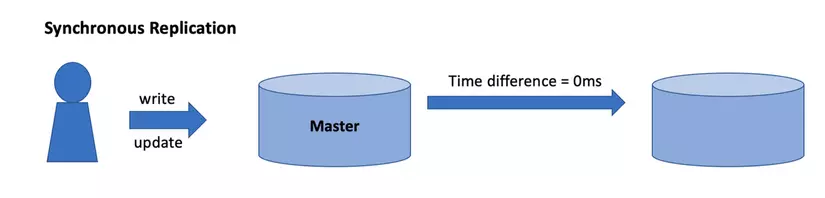
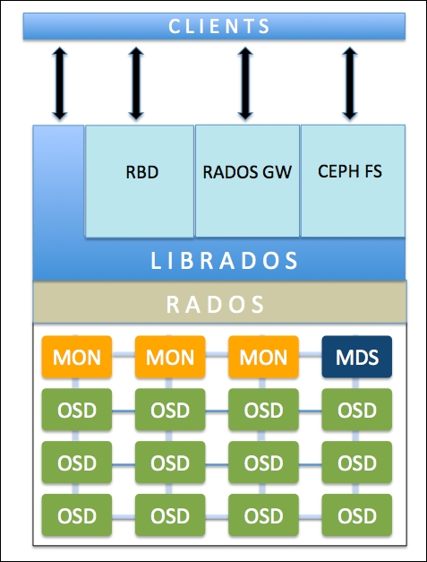
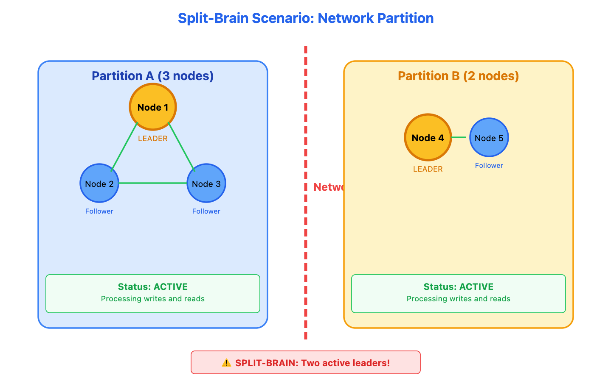
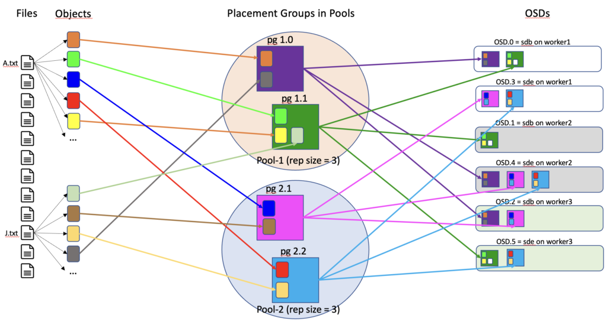

# Nghiên cứu: Storage Fundamentals

---

## 1. Khái niệm nền tảng về Storage

### Nghiên cứu và phân loại
)

- **Block Storage:** Là phương pháp lưu trữ dữ liệu bằng cách chia nhỏ dữ liệu thành các khối độc lập (Block) có kích thước cố định (ví dụ: 512 bytes hoặc 4 KB). Mỗi khối đĩa được gán một địa chỉ duy nhất (Block Address) nhưng không chứa bất kỳ metadata nào ngoại trừ địa chỉ của chính nó.
    * **Cơ chế hoạt động:** Chia nhỏ: Khi lưu một tệp tin (ví dụ: file PDF 10 MB), hệ thống chia file đó thành hàng nghìn khối dữ liệu nhỏ. Phân tán: Các khối này được lưu rải rác ở những vị trí tối ưu nhất trên hạ tầng lưu trữ.
    * **Ưu điểm:**
            * **Hiệu năng và tốc độ cực cao:** Do dữ liệu được ghi/đọc trực tiếp ở mức độ phần cứng (Block Level) mà không tốn chi phí xử lý tầng tệp tin (File System overhead), giúp đạt độ trễ cực thấp và IOPS rất cao.
            * **Linh hoạt tuyệt đối:** Bạn có thể định dạng ổ đĩa theo bất kỳ File System nào tùy chọn, hoặc dùng nó làm vùng lưu trữ thô (Raw Device Mapping) cho Database/Máy ảo.
    * **Nhược điểm:**
            * **Chi phí cao:** Thường triển khai trên hạ tầng đắt đỏ như SAN (Storage Area Network) hoặc đĩa Cloud chuyên dụng.
            * **Không thể chia sẻ trực tiếp cho nhiều máy chủ:** Mặc định, một Block Volume chỉ nên cắm vào một máy chủ duy nhất tại một thời điểm.
            * **Quản lý phức tạp:** Không có tìm kiếm metadata phong phú như Object Storage hay giao diện cây thư mục dễ nhìn như NAS/File Storage.

- **File Storage:** Là phương pháp lưu trữ và quản lý dữ liệu dưới dạng các tệp (file) nằm trong một cấu trúc cây thư mục phân cấp (gồm thư mục gốc, thư mục con và các file).

    * **Cơ chế hoạt động:** Cấu trúc phân cấp: Dữ liệu được sắp xếp theo đường dẫn (Path) cụ thể, quản lý bằng Metadata: hệ thống lưu trữ các thuộc tính định danh cơ bản của file như: tên file, kích thước, ngày tạo, ngày sửa đổi và quyền truy cập, giao thức chia sẻ qua mạng: Khi chạy trên hệ thống lưu trữ dùng chung, máy chủ hoặc thiết bị người dùng truy cập file thông qua các giao thức tiêu chuẩn
    * **Ưu điểm:**
            * Gần gũi & Dễ dùng: Dễ dàng thao tác mở, xem, sửa, xóa trực tiếp qua giao diện quản lý tệp (File Explorer / Finder).
            * Chia sẻ đa người dùng: Cho phép nhiều máy tính hoặc người dùng trong cùng mạng LAN đồng thời truy cập vào một tệp/thư mục.
            * Phân quyền chi tiết: Dễ dàng kiểm soát ai được xem, sửa hay xóa từng thư mục cụ thể (tích hợp Active Directory / LDAP).
    * **Nhược điểm:**
            * Suy giảm hiệu năng khi mở rộng: Khi lưu hàng triệu đến hàng tỷ file, cấu trúc cây thư mục cồng kềnh sẽ khiến việc tra cứu và tìm kiếm bị chậm hẳn đi.
            * Độ trễ cao hơn Block Storage: Tốn chi phí xử lý ở tầng File System nên không phù hợp làm bộ lưu trữ cho các Database nặng.

- **Object Storage:** Là kiểu lưu trữ dữ liệu dưới dạng Object (đối tượng). Mỗi object thường gồm Data (dữ liệu), Metadata (thông tin mô tả) và Object ID (định danh).
  - Cơ chế hoạt động: Dữ liệu được giao tiếp và quản lý hoàn toàn thông qua HTTP/HTTPS RESTful APIs (chủ yếu là chuẩn S3 API với các lệnh cơ bản: PUT, GET, DELETE).
    - Dữ liệu thực tế (Data Payload): Tệp tin gốc (như hình ảnh, video, file backup, file log...).
    - Metadata phong phú (Custom Metadata): Các thuộc tính mô tả chi tiết dữ liệu do người dùng tự định nghĩa (ví dụ: `ID_khach_hang`, `Camera_so`, `Ngay_quay`, `GPS_location`). Không bị giới hạn thuộc tính như File Storage.
    - Mã định danh duy nhất : Một chuỗi định danh duy nhất để hệ thống tìm kiếm và truy xuất object.
    - **Ưu điểm:**
      - Metadata tùy biến linh hoạt: Cho phép gắn hàng trăm nhãn/thẻ dữ liệu vào mỗi object, cực kỳ thuận tiện cho việc phân tích dữ liệu (Analytics) và AI/Machine Learning.
      - Tối ưu chi phí: Giá thành lưu trữ trên mỗi GB rẻ hơn nhiều so với Block Storage hay File Storage.
      - Dễ dàng truy cập qua Internet: Chỉ cần có kết nối mạng và khóa xác thực (API Key / Access Key) là có thể truy xuất dữ liệu từ bất kỳ đâu.
    - **Nhược điểm:**
      - Độ trễ cao hơn (Higher Latency): Không phù hợp cho các tác vụ cần tốc độ đọc/ghi theo thời gian thực (như hệ quản trị CSDL - Database).
      - Không hỗ trợ sửa dữ liệu một phần (No Partial Updates): Nếu muốn sửa 1 ký tự trong file 1 GB, phải tải lại và ghi đè (Overwrite) toàn bộ file 1 GB đó.

| Tiêu chí | Block Storage | File Storage | Object Storage |
|---|---|---|---|
| **Cấu trúc dữ liệu** | Các khối đĩa thô (Blocks) kích thước cố định | Cây thư mục phân cấp (Hierarchy Files/Folders) | Không gian phẳng (Flat Namespace: ID + Data + Metadata) |
| **Interface (Giao diện & Giao thức)** | • Fibre Channel (FC), iSCSI, NVMe-oF • Xuất hiện dưới dạng đĩa thô (`/dev/sda`, `C:`) | • SMB/CIFS (Windows), NFS (Linux) • Xuất hiện dưới dạng thư mục chia sẻ (Shared Directory) | • HTTP/HTTPS RESTful API (chủ yếu là **S3 API**) • Thao tác qua các lệnh `GET`, `PUT`, `POST`, `DELETE` |
| **Performance (Hiệu năng)** | • **Độ trễ (Latency):** Cực thấp (Microseconds) • **IOPS:** Cực cao • **Throughput:** Rất cao | • **Độ trễ:** Trung bình (Milliseconds) • **IOPS:** Trung bình - Khá • **Throughput:** Phụ thuộc mạng LAN | • **Độ trễ:** Cao hơn (Milliseconds - Seconds) • **IOPS:** Thấp cho các thao tác nhỏ lẻ • **Throughput:** Cực cao khi tải file lớn/chạy song song |
| **Khả năng sửa đổi** | Ghi/sửa dữ liệu ở cấp độ từng khối đĩa nhỏ (Partial Write) | Ghi/sửa trực tiếp trên tệp tin | Không thể sửa từng phần; phải tải lên và ghi đè toàn bộ (Immutable) |
| **Khả năng mở rộng** | Hạn chế hơn (Thường theo chiều dọc - Scale-up) | Trung bình (Scale-up hoặc Scale-out NAS) | **Vô hạn** (Mở rộng theo chiều ngang - Scale-out) |
| **Metadata** | Rất ít / Không có | Metadata tệp cơ bản (tên, kích thước, ngày sửa, quyền) | **Metadata phong phú**, có thể tự định nghĩa hàng trăm thẻ/nhãn |

## 2. Các thành phần cơ bản của Storage

### 2.1. HDD, SSD và NVMe

- **HDD:** Là một loại ổ cứng cơ hoạt động dựa trên nguyên lý lưu trữ từ tính. Dữ liệu được ghi và đọc thông qua các đầu đọc/ghi di chuyển trên bề mặt các đĩa từ (Platters) đang quay.
  - **Cấu tạo:**
    - **Đĩa từ:** Là những chiếc đĩa tròn, thường làm bằng nhôm hoặc thủy tinh và được phủ một lớp vật liệu từ tính mỏng. Chính trên bề mặt này, dữ liệu được lưu trữ dưới dạng các vùng từ hóa.
    - **Đầu đọc ghi:** Là những bộ phận nhỏ, di chuyển sát trên bề mặt đĩa từ (nhưng không chạm vào) để thực hiện việc ghi (thay đổi từ tính) hoặc đọc (phát hiện từ tính) dữ liệu.
    - **Cần di chuyển:** Giống như một cánh tay, bộ phận này giữ và điều khiển đầu đọc/ghi di chuyển nhanh chóng và chính xác đến đúng vị trí
    - **Trục quay:** Là trục trung tâm mà các đĩa từ được gắn vào. Trục này quay với tốc độ rất cao và ổn định

  - **Nguyên lý hoạt động:**
    - Về nguyên lý hoạt động, khi máy tính yêu cầu đọc hoặc ghi dữ liệu, bảng mạch điều khiển sẽ ra lệnh. Trục quay làm các đĩa từ quay với tốc độ cao. Cùng lúc đó, cần di chuyển sẽ định vị đầu đọc/ghi đến đúng rãnh và cung chứa dữ liệu. Tại đây, đầu đọc/ghi sẽ thực hiện việc thay đổi hoặc cảm nhận trạng thái từ tính trên bề mặt đĩa để hoàn tất quá trình ghi hoặc đọc dữ liệu từ tính.

  - **Thời gian truy xuất bị ảnh hưởng bởi:**
    - Seek Time (Thời gian tìm track): Thời gian cần truyền động di chuyển đầu đọc đến track mong muốn (~4 - 9 ms)
    - Rotational Latency (Độ trễ quay): Thời gian chờ đĩa xoay đúng Sector đến dưới đầu đọc (~2 - 4 ms).
    - Tổng độ trễ cơ học này khiến HDD bị nghẽn ngẫu nhiên

- **SSD:** Là thiết bị lưu trữ không có bộ phận cơ học chuyển động. Thay vì đĩa từ và đầu đọc như HDD, SSD sử dụng: Chip nhớ flash NAND, Bộ điều khiển
  - **Nguyên lý hoạt động:** Vì không có cơ cấu cơ học, SSD không chịu các giới hạn của: Seek time, Rotational latency.Thay vào đó, bộ điều khiển chỉ cần gửi tín hiệu điện trực tiếp đến đúng địa chỉ ô nhớ. Thời gian truy xuất (Access Time) chỉ còn ~0.1 ms, thay vì 6-13 ms của HDD.

- **So sánh ưu nhược điểm của HDD và SSD**
  | Loại ổ cứng | Ưu điểm | Nhược điểm | Nhu cầu sử dụng phù hợp |
  | :--- | :--- | :--- | :--- |
  | **HDD** (Hard Disk Drive) | • Giá rẻ: Chi phí trên mỗi GB rất thấp. • Dung lượng lớn: Dễ dàng sở hữu các mức từ 2TB–20TB+. • Khôi phục dữ liệu: Cơ hội cứu dữ liệu cao hơn khi gặp sự cố phần cứng. | • Tốc độ chậm: Đọc/ghi thấp (~80–160 MB/s). • Độ bền vật lý kém: Dễ hư hỏng khi bị va đập, rung lắc. • Tiếng ồn & điện năng: Phát ra tiếng rè rè khi chạy, tốn pin và tỏa nhiệt nhiều hơn. | • Lưu trữ dữ liệu khối lượng lớn (phim, ảnh, tài liệu). • Làm ổ sao lưu (Backup), hệ thống NAS, camera giám sát. |
  | **SSD** (Solid State Drive) | • Tốc độ siêu nhanh: Đọc/ghi cao (~500 MB/s đối với SATA, lên tới 3,500–7,500+ MB/s với NVMe). • Chống sốc tốt: Không chứa bộ phận chuyển động, bền bỉ khi di chuyển. • Êm ái & Tối ưu năng lượng: Hoạt động im lặng hoàn toàn, tiết kiệm pin, tỏa nhiệt ít. | • Giá thành cao: Chi phí trên mỗi GB đắt hơn HDD. • Khó khôi phục dữ liệu: Khi hỏng chip nhớ thì khả năng cứu dữ liệu rất thấp. | • Cài đặt Hệ điều hành (Windows/macOS) để máy khởi động nhanh. • Cài ứng dụng nặng, làm đồ họa, dựng video, chơi game. • Tác vụ yêu cầu xử lý dữ liệu tức thì. |

- **NVMe:** là loại ổ cứng thể rắn (SSD) hiện đại sử dụng giao thức truyền dữ liệu tối tân để kết nối trực tiếp với CPU thông qua khe cắm PCIe, mang lại tốc độ vượt trội so với chuẩn SATA truyền thống

### 2.2. RAID, Erasure Coding và Replication

- **RAID:** Là công nghệ ghép nhiều ổ cứng vật lý (HDD hoặc SSD) lại với nhau để hoạt động như một ổ đĩa logic duy nhất, nhằm đạt được tăng tốc độ, tăng độ an toàn, hoặc cả hai. Mục đích chính là bảo vệ dữ liệu không bị mất ngay cả khi có 1 hoặc nhiều ổ cứng bị hỏng vật lý, tăng tốc độ truy xuất 
    * **Cấp độ RAID phổ biến:**
        * RAID 0: Chia nhỏ dữ liệu và ghi đều ra tất cả các ổ đĩa.
            * Số đĩa tối thiểu:  2 ổ
            * Ưu điểm: Tốc độ đọc/ghi nhanh nhất, sử dụng 100% dung lượng đĩa.
            * Nhược điểm: Không có cơ chế an toàn. Hỏng 1 ổ là mất sạch dữ liệu toàn bộ hệ thống
            * Phù hợp: Đồ họa, dựng phim, tác vụ tạm thời cần tốc độ cực cao.
        * RAID 1: Ghi dữ liệu giống hệt nhau vào các ổ đĩa (Copy 1:1).
            * Số đĩa tối thiểu:  2 ổ
            * Ưu điểm: An toàn cao, chết 1 ổ hệ thống vẫn chạy bình thường.
            * Nhược điểm: Tốn dung lượng (chỉ sử dụng được 50% tổng dung lượng).
            * Phù hợp: Chứa hệ điều hành (OS), Database nhỏ, hệ thống tài chính/kế toán.
        * RAID 5: Chia nhỏ dữ liệu và tính toán thông tin kiểm tra lỗi (Parity) phân tán đều trên các ổ.
            * Số đĩa tối thiểu:  3 ổ
            * Ưu điểm: Tối ưu giữa tốc độ, dung lượng (dùng được (n-1)/n dung lượng) và khả năng chịu lỗi (cho phép chết 1 ổ bất kỳ).
            * Nhược điểm: Tốc độ ghi bị giảm nhẹ do tốn CPU/Controller tính Parity.
            * Phù hợp: File Server, NAS văn phòng, Web Server.
        * RAID 10/ RAID 1+0: Kết hợp tốc độ của RAID 0 và độ an toàn của RAID 1 (Soi gương trước, Phân mảnh sau).
            * Số đĩa tối thiểu:  4 ổ
            * Ưu điểm: Hiệu năng đọc/ghi cực nhanh và an toàn vượt trội.
            * Nhược điểm: Chi phí cao (chỉ dùng được 50% dung lượng).
            * Phù hợp: Database tải cao (High-load RDBMS), Virtualization (VMware/Hyper-V).

- **Erasure Coding:** Là một kỹ thuật lưu trữ dữ liệu tiên tiến, giúp bảo vệ dữ liệu khỏi bị mất (như RAID) nhưng tiết kiệm dung lượng hơn rất nhiều so với cách nhân bản (Replication) truyền thống.
  - **Nguyên lý hoạt động:** Erasure Coding chia dữ liệu theo công thức K + M:
    - Chia nhỏ dữ liệu gốc (K): Tập tin dữ liệu ban đầu được chia thành K khối dữ liệu gốc (Data Blocks).
    - Mã hóa và tạo khối dự phòng (M): Hệ thống dùng thuật toán toán học (phổ biến nhất là Reed-Solomon) để tính toán và tạo ra M khối dự phòng/chẵn lẻ (Parity Blocks).
    - Phân tán lưu trữ: Tổng cộng $N = K + M$ khối này được lưu trên $N$ ổ đĩa hoặc N máy chủ khác nhau.
    - **Quy tắc khôi phục:** Chỉ cần K khối bất kỳ trong tổng số N khối (K+ M) là có thể khôi phục lại 100% dữ liệu ban đầu. Điều này đồng nghĩa hệ thống cho phép hỏng tối đa M ổ đĩa/máy chủ cùng lúc mà không mất dữ liệu.
    - **Các loại EC theo tỉ lệ K+M:**

| Cấu hình (K+M) | Tỷ lệ sử dụng dung lượng thực (Storage Efficiency) | Số OSD cho phép hỏng đồng thời (M) | Kịch bản sử dụng phù hợp |
| :--- | :---: | :---: | :--- |
| **EC 2 + 1** | $2 / 3 \approx 66.7\%$ | 1 OSD | Thay thế cho RAID 5 / Replication 2x, dành cho cluster nhỏ. |
| **EC 4 + 2** | $4 / 6 \approx 66.7\%$ | 2 OSD | Cấu hình tiêu chuẩn cân bằng tốt nhất giữa độ an toàn, hiệu năng và chi phí. |
| **EC 8 + 3** | $8 / 11 \approx 72.7\%$ | 3 OSD | Tối ưu dung lượng cho hệ thống Cold Storage / Backup lớn. |
| **EC 8 + 4** | $8 / 12 \approx 66.7\%$ | 4 OSD | Mức độ an toàn cao nhất cho các Data Center quy mô hàng trăm node. |

  - **Khi nào nên dùng:**
    - Lưu trữ dữ liệu ít truy cập (Cold Storage / Warm Storage): Các dữ liệu sao lưu (Backup), phim/ảnh kỷ niệm, tài liệu lưu trữ lâu năm.
    - Hệ thống Object Storage quy mô lớn: Các dịch vụ đám mây như Amazon S3, Google Cloud Storage, Ceph, MinIO đều dùng Erasure Coding làm nòng cốt để tối ưu chi phí hạ tầng.
    - Hệ thống lưu trữ phân tán: EC lý tưởng cho môi trường lưu trữ đa nút, cần bảo vệ dữ liệu khỏi các sự cố phần cứng hoặc gián đoạn mạng giữa các site.

- **Replication:** Là kỹ thuật bảo vệ và tăng cường khả năng truy xuất dữ liệu bằng cách tạo ra nhiều bản sao giống hệt nhau (replicas) của cùng một dữ liệu và lưu trên các ổ đĩa, server hoặc trung tâm dữ liệu (Data Center) khác nhau
  - **Nguyên lý hoạt động:** Hệ số nhân bản (Replication Factor - RF): Là số lượng bản sao mà hệ thống quy định lưu trữ.
    - RF = 2 (Replication 2x): Lưu 1 bản gốc + 1 bản sao (Tổng 2 bản).
    - RF = 3 (Replication 3x): Lưu 1 bản gốc + 2 bản sao (Tổng 3 bản - đây là chuẩn phổ biến nhất trong hệ thống lưu trữ phân tán).
  - **Các mô hình Replication phổ biến:**
  

    - Synchronous Replication: Khi ghi dữ liệu, máy chủ chính phải chờ tất cả các bản sao ở máy chủ phụ ghi xong hoàn tất mới báo thành công cho người dùng.
      - Ưu điểm: Dữ liệu hoàn toàn nhất quán 100% giữa các máy chủ (không lo mất dữ liệu nếu sự cố xảy ra).
      - Nhược điểm: Độ trễ (latency) cao hơn vì phải chờ đường truyền mạng.
    - **Asynchronous Replication:** Máy chủ chính ghi dữ liệu xong sẽ báo thành công ngay cho người dùng, sau đó mới âm thầm đẩy bản sao sang các máy chủ phụ sau.
      - **Ưu điểm:** Tốc độ phản hồi cực nhanh, không gây trễ cho người dùng.
      - **Nhược điểm:** Có rủi ro mất một lượng nhỏ dữ liệu mới ghi nếu máy chủ chính bị sập trước khi kịp gửi bản sao đi.
  - **Khi nào dùng:**
    - Hot data: Dữ liệu cần truy xuất cực nhanh, ít độ trễ
    - Tận dụng tối đa tốc độ đọc
    - Không nên dùng cho những dữ liệu ít truy cập và dữ liệu cực lớn

- **So sánh ưu nhược điểm EC, Repliation**
  | Tiêu chí | Erasure Coding (EC) | Replication (Nhân bản dữ liệu) |
  | :--- | :--- | :--- |
  | **Ưu điểm** | • Tiết kiệm dung lượng cực cao: Hiệu suất sử dụng đĩa từ 60%–80% (chỉ tốn thêm khoảng 20%–50% dung lượng dư thừa). • Chi phí phần cứng thấp: Giảm đáng kể số lượng ổ cứng/server cần mua cho dữ liệu lớn. • Độ tin cậy tùy biến cao: Cho phép chịu lỗi linh hoạt bằng cách tăng số khối $M$ (có thể cho phép chết 3, 4+ node cùng lúc). | • Tốc độ đọc/ghi cực nhanh: Không có độ trễ tính toán mã hóa, tối ưu cho tác vụ I/O cao. • Tiết kiệm tài nguyên CPU/RAM: Chỉ thực hiện thao tác copy/ghi dữ liệu đơn thuần. • Phục hồi dữ liệu tức thì: Khi 1 node sập, hệ thống chỉ cần đọc thẳng từ bản sao khác mà không cần giải toán dựng lại file. |
  | **Nhược điểm** | • Tốn tài nguyên tính toán: Chi phí CPU/RAM cao để mã hóa và giải mã toán học (Reed-Solomon). • Độ trễ (Latency) cao hơn: Tốc độ đọc/ghi ngẫu nhiên (Random Read/Write) chậm hơn. • Tốn băng thông khi Rebuild: Khi 1 node chết, phải gom K khối từ K node khác qua mạng để khôi phục lại dữ liệu. | • Tốn dung lượng & chi phí cao: Thường tốn đến 200% dung lượng dư thừa (lưu 1TB tốn 3TB ổ cứng). • Chi phí vận hành hạ tầng đắt đỏ: Tốn thêm không gian Rack, điện năng và tản nhiệt cho số lượng ổ đĩa dư thừa. |

### 2.3. Storage Controller
* **Storage Controller (Bộ điều khiển lưu trữ)** là một thiết bị phần cứng hoặc phần mềm đóng vai trò cầu nối, quản lý việc truyền tải dữ liệu giữa hệ điều hành/CPU và các thiết bị lưu trữ (như HDD, SSD, băng đĩa, hoặc hệ thống SAN/NAS).
* **Chức năng chính của Storage Controller:**
    * Điều phối luồng dữ liệu: Chuyển đổi lệnh đọc/ghi từ hệ thống thành tín hiệu mà các ổ cứng có thể hiểu và xử lý.
    * Quản lý RAID (RAID Controller): Nối nhiều ổ cứng vật lý thành một hoặc nhiều ổ ảo để tăng tốc độ truy xuất hoặc tăng tính an toàn dữ liệu (sao lưu dự phòng).
    * Bộ đệm dữ liệu (Caching): Tích hợp RAM đệm để tăng tốc tốc độ đọc/ghi dữ liệu tạm thời trước khi lưu chính thức vào ổ cứng.
    * Xử lý lỗi & Giám sát: Phát hiện các khối dữ liệu bị hỏng (bad blocks), dự đoán nguy cơ hỏng hóc ổ đĩa và tự động phục hồi dữ liệu trong mảng RAID.

### 2.4. Storage Network: Ethernet, FC và NVMe-oF

- **Ethernet:** Công nghệ mạng cục bộ (LAN - Local Area Network) phổ biến nhất hiện nay, dùng để kết nối các máy tính, máy chủ, và thiết bị mạng trong cùng một phạm vi địa lý (văn phòng, nhà ở, data center) thông qua dây cáp truyền dẫn. Nó dựa trên 2 thành phần chính:
  - **Cáp và cổng:** Thường là cáp mạng xoắn đôi hoặc cáp quang.
  - **Bộ quy tắc (MAC, Frame):** Giúp các thiết bị nhanh chóng đóng gói dữ liệu và gửi đến vị trí cần thiết.
  - **Ưu điểm:** Tốc độ, hiệu năng cao, ổn định và băng thông lớn hơn Wi-Fi. Độ trễ thấp do không bị nhiễu sóng bởi thiết bị ngoại vi
  - **Nhược điểm:** Thiếu tính linh động do phải cắm dây, chi phí triển khai lớn
  - **Khi nào dùng:** Hệ thống lưu trữ và Data center

- **FC:** Là mạng chuyên dụng công suất cao, được thiết kế riêng cho hệ thống lưu trữ khối doanh nghiệp
  - FC không dùng các giao thức IP thông thường, mà dùng một hệ thống các lớp riêng và kiểm soát luồng riêng biệt để đảm bảo dữ liệu được truyền đi mà không bị mất mát hay tắc nghẽn, một yêu cầu cực kỳ nghiêm ngặt cho dữ liệu lưu trữ.
  - **Ưu điểm:**
    - Hiệu năng cực cao và ổn định: Độ trễ thấp do không bị ảnh hưởng bởi lưu lượng mạng khác.
    - Do dùng cáp quang nên có thể kết nối lưu trữ xa
    - Là mạng tách biệt với mạng LAN/Internet nên giảm nguy cơ bị tấn công bên ngoài
  - **Nhược điểm:**
    - Chi phí cao
    - Phức tạp, linh hoạt

- **NVMe-oF:** Là công nghệ cho phép truy cập ổ NVMe từ xa qua mạng, thay vì NVMe phải gắn trực tiếp vào máy chủ

### 2.5. IOPS, Throughput và Latency

- **IOPS:** Là đơn vị đo lường số lượng tác vụ đọc và ghi mà một thiết bị lưu trữ có thể xử lý trong một giây. Hiệu năng IOPS không cố định mà thường phụ thuộc vào tác vụ I/O:
  - Loại thiết bị lưu trữ: HDD, SSD
  - Loại truy cập dữ liệu: ngẫu nhiên hay tuần tự
  - Kích thước block dữ liệu: kích thước của từng đơn vị dữ liệu được xử lý trong mỗi tác vụ đọc/ghi

- **Throughput:** Là chỉ số đo lường khối lượng dữ liệu thực sự được truyền tải thành công qua một hệ thống trong một đơn vị thời gian nhất định. Nếu IOPS là số "lần" đọc/ghi, thì Throughput là "khối lượng" dữ liệu được chuyển trong mỗi lần đó.

- **Latency:** Là khoảng thời gian từ khi một yêu cầu (Request) được gửi đi cho đến khi nhận được phản hồi (Response) đầu tiên hoặc hoàn tất.
  - Trong hạ tầng lưu trữ: Là thời gian từ khi máy chủ phát lệnh đọc/ghi (Read/Write I/O) đến khi Storage Controller/Ổ đĩa hoàn tất tác vụ đó

- **Mối quan hệ giữa IOPS và Latency:** Latency càng thấp thì IOPS càng cao: Thiết bị xử lý 1 lệnh càng nhanh thì trong 1 giây nó càng nhận được nhiều lệnh tiếp theo.

---

## 3. Các khái niệm của Capacity trong Storage

- **Raw capacity (Tổng dung lượng thô):** Tổng dung lượng vật lý của tất cả ổ cứng cắm vào hệ thống (tính theo con số nhà sản xuất)
- **Usable capacity (Dung lượng sẵn sàng dùng):** Dung lượng còn lại để lưu trữ sau khi trích một phần Raw Capacity làm nhiệm vụ bảo vệ dữ liệu (RAID 1/5/6, Erasure Coding) và làm dung lượng dự phòng.
- **Allocated capacity (Dung lượng đã cấp phát):** Dung lượng mà hệ thống đã cam kết cấp cho các ứng dụng/volume (có thể chưa ghi dữ liệu thực).
- **Used capacity (Dung lượng đã sử dụng):** Dung lượng đã ghi dữ liệu thực sự vào ổ (sau khi áp dụng Replication/EC).
- **Thick-Provisioning:** Cấp phát toàn bộ dung lượng ổ cứng ảo ngay từ khi khởi tạo
  - Hiệu năng: Tối ưu hơn cho tác vụ ghi nặng (Write-intensive) vì dung lượng đã được quy hoạch sẵn.
  - Vận hành: Dễ quản lý, không sợ hết dung lượng bất ngờ.
  - Nhược điểm: Gây lãng phí tài nguyên nếu lượng cấp ra không dùng tới
  - Khi nào dùng: Khi triển khai các ứng dụng doanh nghiệp quan trọng (như Database SQL/Oracle, Mail Server) yêu cầu hiệu năng cao và độ ổn định tuyệt đối.
- **Thin-Provisioning:** Là phương pháp cấp phát dung lượng lưu trữ theo nhu cầu thực tế (động). Tự động mở rộng khi dữ liệu mới ghi vào
  - Hiệu năng: Thấp hơn Thick-provisioning do hệ thống cần thời gian cấp thêm không gian đĩa do dữ liệu phình ra
  - Tối ưu chi phí & tài nguyên: Tiết kiệm tối đa dung lượng lưu trữ
  - Nhược điểm: Cần giám sát kỹ nếu dữ liệu ảo hóa vượt quá ổ đĩa thạt sẽ gây sập hệ thống
  - Khi nào dùng: Khi chạy các hệ thống thử nghiệm, máy chủ Web, hoặc khi ngân sách phần cứng lưu trữ ban đầu còn hạn chế
- **Over-provisioning:** Là việc cấp phát tổng dung lượng ổ đĩa ảo (Logical/Virtual Storage) lớn hơn dung lượng ổ đĩa vật lý (Physical Storage) thực sự có sẵn. Kỹ thuật này đi liền với Thin Provisioning và thường được triển khai trên các hệ thống Storage Array (SAN/NAS) hoặc Cloud Storage.
  - **Ưu điểm:**
    - Tối ưu chi phí đầu tư ban đầu (CAPEX): Không cần chi số tiền lớn mua đủ 100% dung lượng phần cứng ngay từ đầu; chỉ mua vừa đủ dùng cho hiện tại và nâng cấp dần sau.
    - Tận dụng tối đa không gian lưu trữ: Triệt tiêu dung lượng đĩa ảo bị lãng phí
  - **Nhược điểm:**
    - Nguy cơ gián đoạn hệ thống (Downtime): Nếu dung lượng thực tế bị quá tải (Out of Physical Space), toàn bộ các ổ đĩa ảo sẽ bị khóa (chuyển sang chế độ Read-Only), khiến ứng dụng và máy ảo ngưng hoạt động đột ngột.
    - Suy giảm hiệu năng nhẹ: Do cơ chế cấp phát dung lượng động (Thin Provisioning) cần xử lý thêm các tác vụ mở rộng đĩa trong lúc ghi dữ liệu.
- **Vì sao Storage không thể sử dụng 100% capacity ?**
  - Sập hệ thống: Máy ảo và Database sẽ bị treo/crash hoặc bị khóa sang chế độ chỉ đọc (Read-only) khi hết dung lượng trống cho file tạm và log.
  - Lỗi tính năng nâng cao: Không đủ vùng đệm (buffer) để chạy các tính năng như Snapshot, Replication, hay Dọn rác (Garbage Collection).
  - Tụt hiệu năng: Hệ thống mất nhiều thời gian tìm ô trống để ghi, làm tăng độ trễ (latency) và khiến SSD/HDD chạy chậm đi trông thấy.

---

## 4. Storage Architecture

### 4.1. Centralized Storage và Distributed Storage

- **Centralized Storage:** Là mô hình trong đó dữ liệu được lưu trữ tại một hệ thống Storage trung tâm, và nhiều server/client cùng truy cập vào hệ thống đó thông qua mạng.
  - **Ưu điểm:**
    - Quản lý & Bảo mật tập trung: Dễ dàng phân quyền truy cập, kiểm soát dữ liệu và thiết lập chính sách bảo mật tại một điểm duy nhất.
    - Sao lưu (Backup) dễ dàng: Lập lịch backup, snapshot hay khôi phục dữ liệu sau sự cố (Disaster Recovery) nhanh chóng cho toàn bộ hệ thống.
    - Tối ưu dung lượng: Tránh trùng lặp dữ liệu giữa các phòng ban/người dùng; dễ chia sẻ tài nguyên lưu trữ.
  - **Nhược điểm:**
    - Single Point of Failure: Nếu hệ thống lưu trữ trung tâm gặp sự cố, toàn bộ người dùng và ứng dụng liên quan sẽ bị gián đoạn.
    - Nghẽn băng thông mạng (Network Bottleneck): Mọi truy xuất dữ liệu đều qua mạng, nếu hạ tầng mạng kém sẽ gây ra độ trễ cao.
    - Chi phí đầu tư ban đầu lớn: Cần ngân sách cao để mua thiết bị lưu trữ chuyên dụng (SAN/NAS Array), trang bị mạng tốc độ cao (Fiber Channel, 10GbE+) và hạ tầng chịu lỗi

- **Distributed Storage:** là kiến trúc lưu trữ dữ liệu bằng cách chia nhỏ và phân tán dữ liệu trên nhiều máy chủ độc lập (gọi là các Node) kết nối với nhau qua mạng nội bộ hoặc Internet, nhưng vẫn hoạt động như một hệ thống lưu trữ thống nhất.
  - **Cơ chế hoạt động:**
    - Chia nhỏ dữ liệu (Data Chunking): Dữ liệu được cắt thành các mảnh nhỏ (Chunks/Blocks/Objects).
    - Nhân bản hoặc Phân mảnh an toàn (Replication / Erasure Coding): Mỗi mảnh dữ liệu được tự động sao chép thành nhiều bản (thường là 3 bản) hoặc mã hóa rải rác sang các Node khác nhau.
    - Self-Healing: Nếu 1 Node bị hỏng, hệ thống tự động phát hiện và dùng các bản sao còn lại trên các Node khác để khôi phục dữ liệu nguyên vẹn.
  - **Ưu điểm:**
    - No Single Point of Failure: Chịu lỗi cực tốt. Một vài máy chủ hoặc ổ cứng bị hỏng đột ngột thì hệ thống vẫn hoạt động bình thường mà không mất dữ liệu.
    - High Scalability: Mở rộng dung lượng và hiệu năng dễ dàng theo chiều ngang (Scale-out) chỉ bằng cách cắm thêm Node/máy chủ mới vào cụm cluster
    - Hiệu năng đọc/ghi song song: Cho phép nhiều Node cùng tham gia đọc/ghi dữ liệu đồng thời, xử lý rất tốt Big Data.
  - **Nhược điểm:**
    - Quản trị phức tạp: Việc thiết lập, cấu hình mạng, duy trì sự đồng bộ dữ liệu giữa các Node yêu cầu kỹ năng hệ thống cao.
    - Độ trễ mạng (Network Latency): Do dữ liệu phải truyền qua lại giữa các Node qua hạ tầng mạng, độ trễ sẽ cao hơn so với truy xuất trực tiếp trên một hệ thống SAN đắt tiền.
    - Tốn dung lượng cho tính năng an toàn: Nếu dùng cơ chế Replication 3x (lưu 3 bản sao), bạn sẽ tốn gấp 3 lần dung lượng đĩa thực tế.

### 4.2. SAN, NAS và SDS

- **SAN:** một mạng riêng biệt, tốc độ cao kết nối các thiết bị lưu trữ (như tủ đĩa SAN Array) trực tiếp với các máy chủ (Server)
  - **Đặc điểm:**
    - Cấp độ khối (Block-level): Máy chủ kết nối với SAN sẽ nhìn thấy dung lượng lưu trữ giống như một ổ cứng vật lý trống cắm trực tiếp vào máy
    - Mạng riêng biệt tốc độ cao: SAN không chạy chung đường mạng LAN văn phòng thông thường. Nó sử dụng hạ tầng mạng riêng với các giao thức tốc độ cao như Fibre Channel (FC) hoặc iSCSI, NVMe-oF để đạt độ trễ cực thấp và băng thông lớn.
    - Chia sẻ tài nguyên linh hoạt: Cho phép hàng chục/hàng trăm máy chủ cùng kết nối đến một tủ đĩa lưu trữ trung tâm và được phân chia các vùng đĩa ảo
  - **Ưu điểm:**
    - Hiệu năng cực cao & Độ trễ cực thấp: Tối ưu hóa tuyệt đối cho các tác vụ đọc/ghi dữ liệu nặng liên tục.
    - Tải độc lập: Hoạt động lưu trữ/backup dữ liệu qua SAN hoàn toàn không làm nghẽn hay ảnh hưởng đến đường truyền mạng LAN của người dùng.
    - Hỗ trợ tính năng nâng cao: Dễ dàng chạy các tính năng như Snapshot, Replication (chuyển dữ liệu sang trung tâm dự phòng DR), Clustered File Systems.
  - **Nhược điểm:**
    - Chi phí rất đắt đỏ: Yêu cầu các thiết bị phần cứng chuyên dụng giá cao (Card HBA, SAN Switch, Cáp quang FC, Tủ đĩa SAN).
    - Đòi hỏi chuyên môn cao: Việc thiết lập, phân vùng (Zoning, LUN Masking) và vận hành hệ thống SAN phức tạp hơn nhiều so với NAS.
  - **Khi nào dùng:** Hệ quản trị cơ sở dữ liệu lớn, Hạ tầng ảo hóa doanh nghiệp, Data center

- **NAS:** thiết bị lưu trữ dữ liệu chuyên dụng được kết nối với mạng internet hoặc mạng nội bộ (LAN), cho phép nhiều người dùng và thiết bị cùng truy cập, chia sẻ và quản lý tệp tin từ một điểm tập trung
  - **Đặc điểm:**
    - Lưu trữ cấp độ File (File-level Storage): Dữ liệu trên NAS được quản lý dưới dạng cấu trúc tập tin/thư mục (Files/Folders)
    - Kết nối qua mạng LAN/Internet: NAS sử dụng đường mạng cáp Ethernet tiêu chuẩn (RJ45, 1GbE, 2.5GbE, 10GbE) để kết nối vào Router/Switch, không yêu cầu cáp mạng hay card chuyên dụng đắt đỏ như SAN.
  - **Ưu điểm:**
    - Dễ sử dụng & Triển khai: Giao diện đồ họa web thân thiện, dễ cấu hình phân quyền người dùng mà không cần chuyên môn sâu.
    - Chi phí hợp lý: Tận dụng hạ tầng mạng LAN sẵn có, chi phí thấp hơn nhiều so với SAN.
    - An toàn dữ liệu: Tích hợp công nghệ RAID giúp bảo vệ dữ liệu ngay cả khi có 1-2 ổ cứng bị hỏng vật lý.
  - **Nhược điểm:**
    - Phụ thuộc vào băng thông mạng: Tốc độ đọc/ghi bị giới hạn bởi tốc độ của đường truyền mạng LAN
    - Không tối ưu cho ứng dụng nặng: Không phù hợp để làm bộ lưu trữ trực tiếp cho các Database lớn đòi hỏi IOPS cao hoặc máy ảo chạy tải nặng

- **SDS:** là mô hình quản lý và cung cấp Storage bằng phần mềm, tách phần mềm quản lý Storage khỏi phần cứng.
  - **Đặc điểm:**
    - Tách software khỏi hardware → không phụ thuộc quá nhiều vào một hãng phần cứng.
    - Có thể scale-out bằng cách thêm server/disk.
    - Đa dạng chuẩn lưu trữ (Unified Storage): Một cụm SDS có thể cung cấp đồng thời cả Block Storage, File Storage , và Object Storage.
    - Phần mềm quản lý các chức năng như provisioning, replication, RAID/Erasure Coding, data placement...
  - **Ưu điểm:**
    - Linh hoạt, dễ mở rộng, quản lý tập trung bằng phần mềm
    - Có thể tận dụng commodity hardware → giảm chi phí
    - Phù hợp với Cloud và Data Center
  - **Nhược điểm:**
    - Đòi hỏi băng thông mạng lớn: Do các máy chủ phải liên tục đồng bộ dữ liệu với nhau qua mạng, SDS yêu cầu hạ tầng mạng nội bộ tốc độ cao (10GbE, 25GbE, 100GbE) và độ trễ thấp
    - Tốn tài nguyên phần cứng cho OS/SDS: Máy chủ phải tốn một lượng CPU và RAM nhất định để chạy các tiến trình điều khiển của phần mềm SDS.

### 4.3. Scale-up và Scale-out

| Tiêu chí        | **Scale Up (Vertical Scaling)**                                                                                                                         | **Scale Out (Horizontal Scaling)**                                                                                                                                           |
| :-------------- | :------------------------------------------------------------------------------------------------------------------------------------------------------ | :--------------------------------------------------------------------------------------------------------------------------------------------------------------------------- |
| **Cơ chế**      | Thêm RAM/CPU/Đĩa vào server cũ.                                                                                                                         | Mua thêm server mới cắm vào cụm.                                                                                                                                             |
| **Ưu điểm**     | • Triển khai đơn giản, không cần sửa đổi ứng dụng.  • Giữ độ trễ thấp do dữ liệu xử lý trên 1 máy.  • Quản trị dễ dàng, ít tốn chi phí phần mạng. | • Mở rộng gần như vô hạn.  • Kháng lỗi cao (Sập 1 server, các máy khác vẫn chạy).  • Dễ nâng cấp không cần dừng hệ thống (Zero Downtime).                              |
| **Nhược điểm**  | • Chạm giới hạn phần cứng (Hardware Ceiling).  • Chi phí linh kiện cao cấp đắt đỏ.  • Dễ dính Single Point of Failure (Sập máy là dừng toàn bộ).  | • Kiến trúc ứng dụng phức tạp (cần Load Balancer, Distributed Systems).  • Độ trễ tăng do giao tiếp qua mạng giữa các server.  • Tốn chi phí quản trị và hạ tầng mạng. |
| **Phù hợp cho** | Database truyền thống (SQL Server, RDBMS), Tủ lưu trữ SAN/NAS.                                                                                          | Cloud Native, Distributed Storage (Ceph, MinIO), NoSQL, Big Data, Kubernetes.                                                                                                |

### 4.4. Local Storage và Shared Storage

- **Local Storage:** Ổ đĩa (SSD/HDD) được cắm trực tiếp bên trong một máy chủ vật lý.
  - **Hiệu năng và độ trễ:** Cực cao, độ trễ thấp nhất.
  - **Tính HA:** Thấp.
- **Shared Storage:** Hệ thống lưu trữ tập trung (SAN/NAS/SDS) nằm ngoài máy chủ, cho phép nhiều máy chủ cùng kết nối và truy cập dữ liệu qua mạng.
  - **Hiệu năng và độ trễ:** Bị giới hạn bởi hiệu năng và băng thông mạng.
  - **Tính HA:** Cao.
  - **Khi nào dùng:** Cần hiệu năng I/O tối đa và độ trễ thấp nhất cho các hệ quản trị CSDL tải cao.

### 4.5. Data path và Control path

- **Data path:** Truyền tải, ghi, đọc và xử lý dữ liệu thực tế của người dùng/ứng dụng. Thực thi các lệnh cặn kẽ: Read, Write, Forward packet, Encryption.
  - Yêu cầu tối ưu: Tốc độ (Throughput) & Độ trễ (Latency) cực thấp.
  - Tần suất & tải: Chạy liên tục 24/7 với lưu lượng cực lớn (Băng thông cao).
- **Control path:** Quản lý, cấu hình, điều phối và thiết lập quy tắc cho hệ thống. Ra quyết định: Routing table, Cấp phát LUN/Storage, Authentication, Monitoring.
  - Yêu cầu tối ưu: Độ chính xác, Tính sẵn sàng & Bảo mật.
  - Tần suất & tải: Chạy theo sự kiện/yêu cầu quản trị (Lưu lượng rất nhỏ)
  - Khai nào dùng: Triển khai hạ tầng ảo hóa doanh nghiệp
- **Ceph:**

  - **Control Path (Luồng điều khiển) -> Public Network**: Luồng điều khiển chịu trách nhiệm khởi tạo kết nối, trao đổi metadata điều khiển và cập nhật trạng thái toàn bộ hệ thống Ceph:
      - Trao đổi Cluster Map: Khi Client gửi yêu cầu truy cập, Client gửi request tới Ceph MON trên đường Public Network để lấy OSD Map (bản đồ vị trí các OSD).
      - Heartbeat & Monitor Status: Các OSD liên tục gửi tín hiệu heartbeat và báo cáo trạng thái sức khỏe (health status) cho MON / MGR qua Public Network.
      - Phát hiện lỗi: Nếu một OSD bị chết, tin nhắn báo hiệu OSD down được lan truyền và gửi về MON qua đường mạng này.
  - **Data Path (Luồng dữ liệu) -> Cluster Network** 
      - Khi Primary OSD nhận được dữ liệu từ Client, nó có nhiệm vụ đồng bộ dữ liệu này sang các OSD dự phòng khác (Secondary / Tertiary OSDs).
      - Luồng đồng bộ, nhân bản (Replication) hoặc phân tán các mảnh Erasure Coding này chỉ chạy trên Cluster Network.
      - Sau khi tất cả OSD phụ xác nhận ghi xong qua Cluster Network, Primary OSD mới phản hồi báo thành công cho Client qua Public Network.
