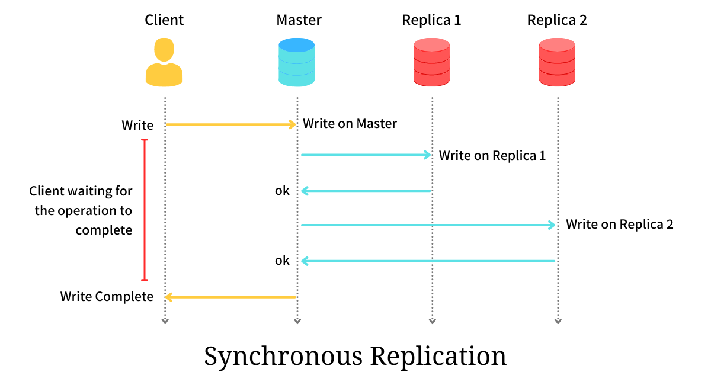
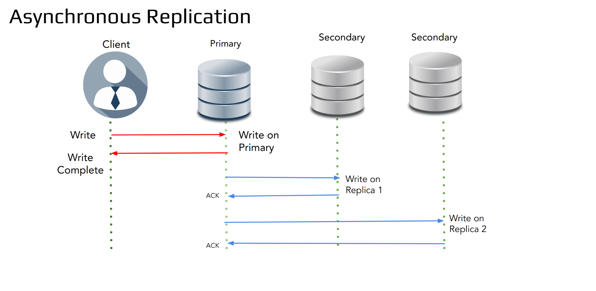
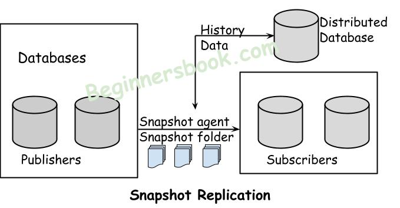
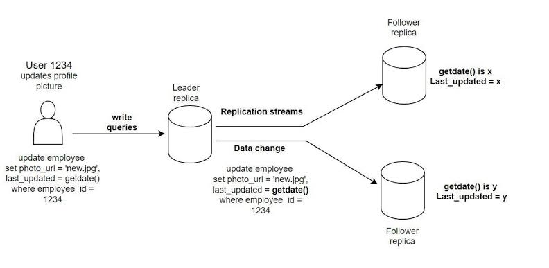
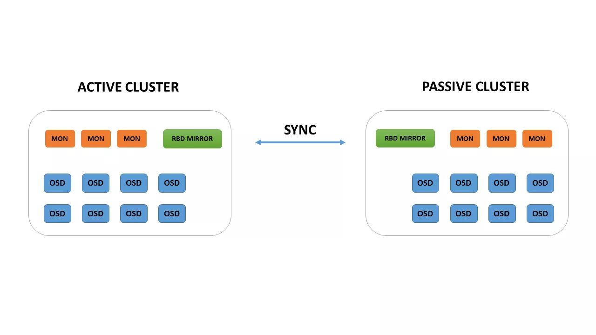
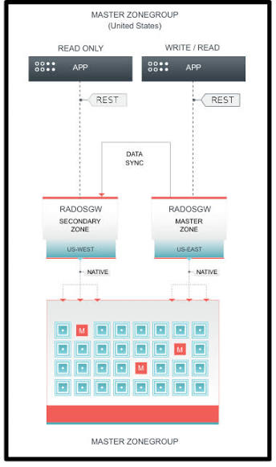

# Nghiên cứu: DR
---

## 1. So sánh các khái niệm 
- **Backup vs DR:**
    | **Tiêu chí so sánh** | **Backup (Sao lưu dữ liệu)** | **Disaster Recovery (DR)** |
    |---|---|---|
    | **Mục tiêu chính** | Khôi phục **tệp tin hoặc dữ liệu** bị mất, hỏng do vô tình xóa hoặc lỗi phần mềm. | Duy trì **vận hành của cả hệ thống** khi gặp thảm họa diện rộng. |
    | **Thời gian khôi phục** | **Chậm**: Có thể mất từ vài giờ đến nhiều ngày do phải mua phần cứng và cài lại hệ thống. | **Nhanh**: Có thể chỉ vài phút nhờ cơ sở hạ tầng dự phòng đã được thiết lập. |
    | **Chi phí đầu tư** | **Thấp**: Chủ yếu chi trả cho dung lượng lưu trữ dữ liệu. | **Cao hơn**: Cần đầu tư hoặc duy trì hạ tầng dự phòng. |
    | **Đối tượng được bảo vệ** | Bảo vệ **dữ liệu** (file, database...). | Bảo vệ **toàn bộ hệ thống** (dữ liệu + máy chủ + phần mềm + mạng). |
    | **Quy trình khi có sự cố** | Thường **thủ công**: Khôi phục dữ liệu rồi cài đặt/cấu hình lại hệ thống. | Có thể **tự động chuyển sang hệ thống dự phòng** khi hệ thống chính gặp sự cố. |
    | **Tác động đến khách hàng** | Dịch vụ có thể phải **gián đoạn** trong quá trình khôi phục. | Có thể **duy trì dịch vụ** với thời gian gián đoạn rất thấp. |

    - Mối quan hệ giữa Backup và DR:
        - Nếu chỉ có Backup mà không có DR: Khi Data Center chính bị sập hoàn toàn, có các bản sao lưu dữ liệu an toàn. Tuy nhiên, do không có máy chủ dự phòng, không có cấu hình mạng, DNS, Router hay Load Balancer sẵn có. Do đó, sẽ mất nhiều ngày để mua/thuê máy chủ mới, cài đặt lại ứng dụng, cấu hình lại hệ thống rồi mới restore dữ liệu vào -> RTO cực cao.
        - Nếu có DR: Khi Site chính gặp sự cố, hệ thống giám sát tự động phát hiện và chuyển hướng traffic sang Site dự phòng (Secondary Site) đã được dựng sẵn (Active-Passive / Active-Active). Toàn bộ ứng dụng và dữ liệu tiếp tục phục vụ người dùng gần như ngay lập tức -> RTO và RPO cực thấp.

- **HA vs DR:**
    | **Tiêu chí** | **High Availability (HA)** | **Disaster Recovery (DR)** |
    |---|---|---|
    | **Mục tiêu chính** | Duy trì hệ thống **hoạt động liên tục**, không bị gián đoạn khi gặp các lỗi phần cứng/phần mềm thông thường. | **Khôi phục toàn bộ hệ thống** về trạng thái hoạt động bình thường khi gặp thảm họa diện rộng. |
    | **Quy mô sự cố** | Cấp độ thành phần (Component-level failover): Hỏng 1 ổ cứng, hỏng 1 Server, chết 1 Switch, lỗi 1 process DB. | Cấp độ hạ tầng/địa lý (Site-level Disaster): Mất điện toàn bộ Data Center, cháy nổ, ngập lụt, đứt cáp biển, tấn công mạng quy mô lớn. |
    | **Phạm vi địa lý** | Thường nằm trong **cùng 1 Data Center** hoặc cùng 1 Local Cluster (Latency thấp, kết nối LAN/SAN). | Nằm ở **2 Data Center tách biệt** về địa lý (khác thành phố, vùng hoặc Region). |
    | **Chỉ số RPO / RTO** | **RPO ≈ 0**: Hầu như không mất dữ liệu. **RTO ≈ 0**: Chuyển giao gần như tức thì, thường trong vài giây. | **RPO > 0**: Có thể mất dữ liệu từ vài giây đến vài phút/giờ tùy cơ chế đồng bộ. **RTO > 0**: Mất từ vài phút đến vài giờ để khôi phục. |
    | **Cơ chế chuyển giao** | Tự động hoàn toàn (Automated failover qua Load Balancer, Virtual IP, Cluster Manager). | Có thể tự động hoặc kích hoạt thủ công (Manual failover / Runbook) sau khi đánh giá tình hình. |
    | **Chi phí & Độ phức tạp** | Tối ưu chi phí bằng cách chia tải (Active-Active) | Chi phí cao vì phải duy trì hạ tầng dự phòng (Standby) ở nơi khác và đường truyền WAN/DirectConnect. |

- **Local failure vs Site failure:**
    | **Tiêu chí** | **Local Failure (Sự cố cục bộ)** | **Site Failure (Sự cố toàn site / thảm họa)** |
    |---|---|---|
    | **Phạm vi ảnh hưởng** | Giới hạn trong **một thành phần đơn lẻ** hoặc một cụm nhỏ thiết bị tại một Data Center. | **Toàn bộ Data Center** hoặc toàn bộ Region/Vùng địa lý bị ngưng hoạt động. |
    | **Nguyên nhân phổ biến** | • Hỏng 1 ổ cứng (Disk failure) • Cháy 1 nguồn máy chủ (PSU) • Lỗi RAM/CPU trên 1 Server • Lỗi một tiến trình dịch vụ (Crash Process) • Hỏng 1 Switch/NIC mạng | • Mất điện diện rộng toàn Trung tâm dữ liệu • Cháy nổ, ngập lụt, động đất, thiên tai • Đứt toàn bộ tuyến cáp quang kết nối vào Data Center • Tấn công Cyber/Ransomware làm sập toàn bộ hạ tầng điều hành |
    | **Giải pháp kiến trúc** | **High Availability (HA)** • Clustering / Load Balancing | **Disaster Recovery (DR)** • Multi-site Replication (Async/Sync) • Cross-region Failover |
    | **Cơ chế xử lý** | Auto-failover nội bộ trong cùng Data Center (chuyển traffic sang Server dự phòng trong cluster). | Kích hoạt kịch bản chuyển vùng (Site Failover/Runbook) để đưa hệ thống dự phòng ở vị trí địa lý khác lên online. |
    | **Mức độ phức tạp khôi phục** | Thấp. Hệ thống tự khắc phục hoặc kỹ sư thay thế linh kiện hỏng tại chỗ mà không làm ngắt dịch vụ. | Cao. Yêu cầu kiểm tra tính toàn vẹn dữ liệu, chuyển hướng DNS/BGP, cấu hình lại mạng và quy trình khôi phục site chính (Failback). |

---
# 2. Nhóm trạng thái sẵn sàng 
- **Cold Standby:** là mô hình dự phòng hệ thống ở trạng thái hoàn toàn tắt hoặc chưa được cấu hình/kích hoạt sẵn trong điều kiện vận hành bình thường.
    -  Cách khôi phục: Khi hệ thống chính sập, kỹ thuật viên cần can thiệp thủ công (bật nguồn, khôi phục dữ liệu từ bản sao lưu gần nhất, cấu hình lại mạng) để đưa hệ thống dự phòng vào hoạt động.
    - Ưu điểm:
        - Chi phí đầu tư rất thấp, tiết kiệm tài nguyên và không gây áp lực hiệu suất cho hệ thống chính
    - Nhược điểm:
        - Thời gian khôi phục (RTO) lâu: Khi sự cố xảy ra, kỹ sư phải bật máy chủ, cài đặt/cấu hình hệ thống, khôi phục dữ liệu từ bản sao lưu và định tuyến lại truy cập. Quá trình này có thể mất nhiều giờ hoặc thậm chí nhiều ngày.
        - Độ lệch dữ liệu (RPO) có thể cao: Dữ liệu hệ thống dự phòng phụ thuộc vào tần suất sao lưu (backup) định kỳ gần nhất, do không được đồng bộ hóa theo thời gian thực (real-time replication).
    - Use case: Các ứng dụng nội bộ, dịch vụ không yêu cầu tính sẵn sàng cao (High Availability - HA) hoặc không ảnh hưởng trực tiếp đến doanh thu theo từng phút. 

- **Warm standby:** hệ thống dự phòng được bật sẵn và duy trì ở trạng thái chờ. Dữ liệu từ hệ thống chính được đồng bộ hóa định kỳ sang hệ thống warm standby, nhưng hệ thống này không xử lý lưu lượng truy cập thực tế cho đến khi hệ thống chính gặp sự cố (failover)
    - Ưu điểm:
        - Thời gian khôi phục (RTO) tương đối nhanh: Do hạ tầng đã bật sẵn, khi hệ thống chính ngắt kết nối, chỉ cần chuyển hướng truy cập (Routing/DNS switch) và kích hoạt các dịch vụ liên quan. Thời gian gián đoạn thường tính bằng phút đến dưới một giờ.
        - Mất mát dữ liệu (RPO) thấp: Dữ liệu được đồng bộ liên tục hoặc theo các khoảng thời gian ngắn (ví dụ: mỗi 5–15 phút), giúp giảm thiểu dữ liệu bị mất so với Cold Standby.
        - Chi phí tối ưu hơn Hot Standby: Hệ thống dự phòng có thể duy trì ở quy mô phần cứng nhỏ hơn (scale-down) hoặc không cần đồng bộ giao dịch thời gian thực (real-time replication), giúp tiết kiệm tài nguyên.
    - Nhược điểm:
        - Vẫn có độ trễ khi chuyển giao: Không giống như Hot Standby (chuyển đổi tức thì trong vài mili giây), Warm Standby vẫn cần một khoảng thời gian ngắn để hệ thống nhận diện sự cố, cập nhật cấu hình mạng (DNS) và kích hoạt đầy đủ tài nguyên.
    - Usecase: Các hệ thống cốt lõi của doanh nghiệp cần khôi phục nhanh nhưng chấp nhận được thời gian gián đoạn ngắn (ví dụ: ứng dụng quản lý nội bộ, cổng thông tin khách hàng, hệ thống API).

- **Hot standby:** hệ thống dự phòng chạy song song, đồng bộ dữ liệu thời gian thực và có cùng cấu hình hiệu năng với hệ thống chính. Khi hệ thống chính gặp sự cố, hệ thống dự phòng sẽ lập tức tiếp quản toàn bộ công việc mà không làm gián đoạn trải nghiệm của người dùng.
    - Ưu điểm: 
        - Không có thời gian chết (RTO = 0): Quá trình chuyển giao (failover) diễn ra hoàn toàn tự động và gần như tức thì (tính bằng mili giây). Người dùng cuối thường không nhận ra hệ thống vừa gặp sự cố.
        - Không mất mát dữ liệu (RPO = 0): Dữ liệu được ghi đồng thời vào cả hai hệ thống (đồng bộ hóa hoàn toàn).
    - Nhược điểm:
        - Chi phí đắt đỏ nhất: Doanh nghiệp phải duy trì hai hệ thống có cấu hình mạnh mẽ như nhau (nhân đôi chi phí phần cứng, phần mềm, bản quyền và điện năng/hạ tầng cloud).
        - Băng thông mạng lớn: Đòi hỏi đường truyền kết nối giữa hai hệ thống cực nhanh và ổn định để đồng bộ dữ liệu liên tục không độ trễ.
    - Usecase: Hệ thống thanh toán, tài chính - ngân hàng: Nơi mọi giao dịch tiền tệ đòi hỏi độ chính xác tuyệt đối và không thể dừng hoạt động. Ứng dụng thương mại điện tử quy mô lớn: Nơi mỗi phút gián đoạn dịch vụ đều gây thiệt hại trực tiếp về doanh thu và uy tín.

---
# 3. Các mô hình vận hành 
- **Active-Active:** Tất cả các máy chủ (hoặc nút/node) đều ở trạng thái hoạt động song song, sẵn sàng xử lý yêu cầu và chia sẻ tải thông qua cơ chế cân bằng tải (Load Balancer).
    - Tác động RTO/ RPO:
        - RPO: Gần như bằng 0.
        - RTO: Gần như bằng 0 (Load Balancer chỉ cần cắt traffic khỏi node bị hỏng).
    - Ưu điểm: 
        - Tối ưu hóa tài nguyên: Sử dụng toàn bộ năng lực phần cứng hiện có, tránh lãng phí tài nguyên ở trạng thái chờ.
        - Hiệu năng & Khả năng mở rộng cao: Chia sẻ lưu lượng truy cập giúp giảm tải cho từng máy chủ đơn lẻ, cho phép mở rộng chiều ngang (Scale-out) dễ dàng bằng cách thêm nút mới.
        - Không có thời gian gián đoạn (Zero Downtime): Khi một nút sập, người dùng gần như không nhận ra vì các nút khác vẫn đang xử lý yêu cầu song song.
    - Nhược điểm:
        - Độ phức tạp trong đồng bộ dữ liệu: Việc giữ cho dữ liệu đồng bộ tức thời (Consistency) giữa nhiều nút đang cùng ghi/sửa dữ liệu rất phức tạp, dễ gặp tình trạng tranh chấp dữ liệu (Data Contention).
        - Chi phí cấu hình & Quản lý cao: Yêu cầu các giải pháp cân bằng tải phức tạp và cơ chế quản lý trạng thái (State management) chặt chẽ.

- **Active-passive:** Traffic chỉ đi vào node Active. Node Passive nhận sao chép dữ liệu và đứng ở trạng thái chờ (Standby). Khi node Active chết, cơ chế Health Check / Heartbeat phát hiện và kích hoạt Failover để biến Passive thành Active.
    - Tác động RTO/ RPO:
        - RPO: Phụ thuộc vào cơ chế Replication bên dưới (Synchronous = 0, Asynchronous = vài giây/phút).
        - RTO: Vài giây đến vài phút (thời gian phát hiện sự cố + thời gian nhảy IP/DNS + promotion).
    - Ưu điểm:
        - Thiết kế đơn giản: Dễ cấu hình, quản lý và triển khai hơn nhiều so với Active-Active vì chỉ có một nút xử lý luồng ghi/sửa chính tại một thời điểm.
        - Tính nhất quán dữ liệu cao: Giảm thiểu nguy cơ xung đột dữ liệu do mọi thao tác ghi đều đi qua một điểm duy nhất (Single Point of Write).
    - Nhược điểm:
        - Lãng phí tài nguyên: Nút Passive tiêu tốn chi phí duy trì phần cứng/hạ tầng nhưng không đóng góp vào việc xử lý tải hàng ngày.
        - Thời gian gián đoạn khi Failover: Khi xảy ra sự cố, hệ thống mất một khoảng thời gian ngắn (từ vài giây đến vài phút) để phát hiện sự cố, chuyển đổi trạng thái nút Passive thành Active và định tuyến lại truy cập.

- **Sync Replication:** là cơ chế đồng bộ dữ liệu mà trong đó, một giao dịch (Transaction) ghi/sửa/xóa dữ liệu chỉ được coi là hoàn tất (Commit) khi dữ liệu đó đã được ghi thành công vào cả máy chủ chính (Primary/Master) và máy chủ dự phòng (Secondary/Standby/Replica).

    - Cách hoạt động: 
        - Hệ thống nhận một yêu cầu ghi dữ liệu mới ở máy chủ chính
        - Máy chủ chính ghi dữ liệu vào thiết bị của mình
        - Dữ liệu tiếp tục được gửi qua mạng đến máy chủ phụ.
        - Máy chủ phụ ghi dữ liệu và gửi phản hồi xác nhận thành công lại cho máy chủ chính.
        - Máy chủ chính mới báo cáo hoàn thành giao dịch cho ứng dụng
    - Ưu điểm:
        - Không mất dữ liệu (RPO = 0): Dữ liệu ở máy chủ chính và dự phòng luôn đồng bộ 100% tại mọi thời điểm. Nếu máy chủ chính bị hỏng hoàn toàn ngay lập tức, máy chủ dự phòng có đầy đủ dữ liệu mới nhất mà không mất một byte nào.
        - Tính nhất quán cao (Strong Consistency): Mọi ứng dụng hoặc người dùng đọc dữ liệu từ máy chủ Secondary đều thấy kết quả hoàn toàn giống hệt Primary.
    - Nhược điểm:
        - Tăng độ trễ (High Latency): Thời gian phản hồi của lệnh ghi sẽ bằng (Thời gian xử lý tại Primary) + (Độ trễ mạng giữa 2 máy chủ) + (Thời gian xử lý tại Secondary). Nếu 2 Data Center nằm ở 2 thành phố khác nhau, độ trễ mạng sẽ làm ứng dụng bị chậm đi đáng kể.
        - Phụ thuộc tính sẵn sàng (Availability Risk): Nếu đường truyền mạng giữa 2 DC bị đứt hoặc máy chủ Secondary bị treo, máy chủ Primary cũng sẽ bị tắc nghẽn hoặc dừng nhận lượt ghi mới (vì nó cố chờ phản hồi ACK từ Secondary nhưng không nhận được).
    - Ứng dụng: Hệ thống giao dịch Tài chính - Ngân hàng, Ví điện tử, Bảng cân đối kế toán.
    - Kiến trúc: Trạng thái Standby: Dùng cho Hot Standby (Active-Passive) hoặc Active-Active trong cùng một Data Center hoặc giữa 2 Data Center ở gần nhau (khoảng cách dưới 100km để đảm bảo Latency thấp).
 

- **Async Replication:**  là phương pháp sao chép dữ liệu trong đó hệ thống chính (primary/master) ghi nhận dữ liệu và phản hồi lại ứng dụng ngay lập tức, sau đó mới tiến hành chuyển bản sao dữ liệu sang các máy chủ phụ (replica/slave) ở chế độ nền (background)

    - Cách hoạt động:
        - Giao dịch hoặc dữ liệu được gửi đến máy chủ chính.
        - Máy chủ chính ghi dữ liệu vào hệ thống của mình và xác nhận thành công cho người dùng/ứng dụng mà không cần chờ máy chủ phụ.
        - Dữ liệu được đồng bộ sang máy chủ phụ ở phía sau (trong nền) sau một khoảng trễ nhỏ hoặc theo chu kỳ
    - Ưu điểm:
        - Tốc độ xử lý cực nhanh (Low Latency): Thời gian phản hồi của lệnh ghi không bị ảnh hưởng bởi đường truyền mạng hay tốc độ của máy chủ dự phòng.
        - Không giới hạn khoảng cách địa lý: Rất phù hợp để triển khai Disaster Recovery giữa 2 Data Center ở xa nhau (ví dụ: một DC ở Hà Nội, một DC ở TP.HCM hoặc AWS Region khác).
    - Nhược điểm:
        - Nguy cơ mất dữ liệu ($RPO > 0$): Vì dữ liệu được gửi đi sau, luôn có một khoảng trễ nhỏ (Replication Lag). Nếu máy chủ Primary bị cháy ổ đĩa hoặc sập đột ngột đúng lúc dữ liệu vừa ghi chưa kịp gửi sang Secondary, phần dữ liệu trong khoảng trễ đó sẽ bị mất vĩnh viễn.
        - Bất đồng bộ dữ liệu tạm thời (Eventual Consistency): Người dụng đọc dữ liệu từ máy chủ Secondary có thể sẽ thấy dữ liệu cũ hơn so với dữ liệu trên Primary trong một vài mili-giây đến vài giây.
    - Ứng dụng: Hệ thống Báo cáo / Analytics (Read Replica): Đọc dữ liệu báo cáo từ Secondary mà không gây tải cho Primary. Các mạng xã hội (Facebook, TikTok): Bài đăng, lượt Like hay Comment của  có thể mất 1–2 giây mới xuất hiện ở phía người dùng khác.

- **Snap-shot based replication:** là cơ chế sao chép dữ liệu bằng cách chụp lại toàn bộ trạng thái dữ liệu tại một thời điểm cố định (Point-in-time Snapshot) của hệ thống nguồn (Primary) và truyền toàn bộ khối dữ liệu đó (hoặc phần chênh lệch) sang hệ thống dự phòng (Secondary). Snapshot-based replication hoạt động theo chu kỳ thời gian (ví dụ: mỗi 1 giờ, 6 giờ, hoặc 24 giờ một lần).

    - Cách hoạt động:
        - Tạo Snapshot: Hệ thống tạo một "bức ảnh" kỹ thuật số ghi lại cấu trúc, siêu dữ liệu (metadata) hoặc trạng thái của dữ liệu tại giây phút đó mà không cần copy toàn bộ file thủ công ngay lập tức
        - Nhân bản (Replication): Bản snapshot này được chuyển tới máy chủ dự phòng, trung tâm dữ liệu khác hoặc mây (cloud) để lưu trữ phục vụ cho mục đích khảm phục thảm họa (Disaster Recovery)
    - Ưu điểm:
        - Không làm giảm hiệu năng ghi của ứng dụng: Quá trình chụp snapshot diễn ra nhanh ở tầng đĩa (Copy-on-Write) và truyền ngầm, không bắt ứng dụng/người dùng phải chờ đợi như Synchronous Replication.
        - Tiết kiệm tài nguyên mạng (với Incremental Snapshot): Khi kết hợp với cơ chế deduplication (loại bỏ dữ liệu trùng lặp) và truyền dạng chênh lệch, băng thông mạng được tối ưu đáng kể.
    - Nhược điểm: 
        - Độ lệch dữ liệu cao (RPO lớn): Nếu chu kỳ chụp snapshot là 4 tiếng/lần và hệ thống chính sập vào lúc 3 giờ 59 phút, bạn sẽ mất sạch dữ liệu của gần 4 tiếng hoạt động đó.
        - Không đáp ứng được thời gian thực: Không thể dùng cho các hệ thống yêu cầu Hot Standby hoặc Active-Active.
    - Ứng dụng: 
        - Trạng thái Standby: Dùng cho Cold Standby hoặc Warm Standby.
        - Backup/DR cho toàn bộ Virtual Machine (VM) hoặc Cloud Instance, Hệ thống quản lý nội bộ, CMS, Website thông tin không có tần suất cập nhật dữ liệu cao.

- **Log-based replication:**  là phương pháp đồng bộ dữ liệu chuẩn mực và phổ biến nhất được sử dụng trong các hệ thống quản trị cơ sở dữ liệu (DBMS) hiện đại. Thay vì sao chép toàn bộ bảng hay đĩa lưu trữ, cơ chế này chỉ sao chép và truyền tải file nhật ký ghi lại các thao tác thay đổi dữ liệu (Transaction Log / Write-Ahead Log) từ máy chủ chính sang các máy chủ dự phòng.

    - Cách hoạt động:
        - Khi ứng dụng thực hiện thao tác ghi/sửa dữ liệu, Primary DB ghi lại chi tiết thay đổi đó vào File Log cục bộ dưới dạng một chuỗi sự kiện sequential.
        - Một tiến trình ngầm (Sender/Log Streamer) trên Primary DB liên tục đọc các khối Log mới và đẩy qua đường truyền mạng sang Secondary DB.
        - Secondary DB nhận các khối Log này và ghi tạm vào bộ đệm hoặc File Log chuyển tiếp (Relay Log).
        - Tiến trình "Apply" trên Secondary DB đọc các dòng Log từ Relay Log và thực thi lại đúng các thao tác đó trên tập dữ liệu cục bộ của nó.
    - Các dạng log phổ biến:
        - Physical log: Ghi lại chính xác các thay đổi ở cấp độ khối đĩa/trang bộ nhớ (Bytes/Storage Blocks). Tốc độ xử lý và Replay cực nhanh, độ chính xác tuyệt đối. Tuy nhiên, yêu cầu máy chủ Primary và Secondary phải sử dụng cùng phiên bản Database và kiến trúc hệ thống.
        - Logical log: Ghi lại các sự kiện thay đổi cấp hàng (Row-level events), ví dụ: "Bảng Users, hàng ID=5, đổi cột Status từ Pending sang Active. Linh hoạt cao. Cho phép đồng bộ giữa các phiên bản Database khác nhau, hoặc chỉ đồng bộ một vài bảng cụ thể (Table-level replication).
    - Ưu điểm:
        - Tốc độ truyền cực nhanh & Tiết kiệm băng thông: File Log chỉ chứa thông tin thay đổi nhỏ gọn (vài trăm bytes) chứ không truyền toàn bộ dữ liệu, giúp giảm tối đa latency mạng.
        - Hỗ trợ cả Synchronous và Asynchronous: Có thể cấu hình gửi Log theo dạng chờ xác nhận (Sync) hoặc gửi ngầm (Async) tùy nhu cầu kinh doanh.
    - Nhược điểm:
        - Yêu cầu xử lý Replication Lag: Nếu máy chủ Secondary có CPU/Disk I/O yếu hơn Primary, tốc độ Replay Log sẽ không đuổi kịp tốc độ ghi Log từ Primary truyền sang, dẫn đến trễ dữ liệu.
        - Xung đột khi Active-Active: Nếu dùng Log Replication cho mô hình Multi-Master (cả 2 bên cùng ghi), việc "phát lại" Log của nhau dễ dẫn đến xung đột khóa chính (Primary Key Conflict) nếu không được thiết kế kỹ
        
| **Nhóm mô hình** | **Mô hình chi tiết** | **Trạng thái dự phòng / Vận hành** | **Luồng Traffic (Đọc/Ghi)** | **RTO** | **RPO** | **Kỹ thuật đồng bộ cốt lõi** | **Kịch bản áp dụng thực tế** |
|---|---|---|---|---|---|---|---|
| **Active - Passive** *(Có Standby)* | **1.1 Hot Standby** *(Dự phòng nóng)* | Standby bật **100% công suất** (Phần cứng, App, DB chạy sẵn nhưng không nhận traffic). | 100% Traffic đi vào Primary Site. Secondary đứng chờ Failover. | ≈ 0 *(Vài giây – < 1 phút)* | = 0 *(hoặc tiệm cận 0)* | • Synchronous Replication • Log-based Physical Replication *(PostgreSQL Streaming, MySQL Group Rep, Oracle Data Guard)* | • Core Banking, Thanh toán thẻ, Ví điện tử. • DB cốt lõi yêu cầu **Zero Data Loss** tuyệt đối, ứng dụng chưa xử lý được xung đột 2 chiều. • Yêu cầu khoảng cách < 100 km. |
| **Active - Passive** *(Có Standby)* | **1.2 Warm Standby** *(Pilot Light)* | Standby bật sẵn Core/DB (App/Web ở dạng Image/Template hoặc scale-down). | 100% Traffic đi vào Primary Site. | Vài phút – vài chục phút *(Cần time Auto-scale / bật App)* | Vài giây – vài phút | • Asynchronous Log-based Replication • Ceph RBD Mirroring • Ceph RGW Multi-site *(1 chiều)* | • ERP, CRM, E-commerce quy mô vừa & lớn triển khai Disaster Recovery Cross-Region *(HN → HCM, AWS → On-prem).* • Tối ưu chi phí hạ tầng. |
| **Active - Passive** *(Có Standby)* | **1.3 Cold Standby** *(Dự phòng lạnh)* | Standby **tắt hoàn toàn** (Hạ tầng trống, không có máy chủ chạy App). | 100% Traffic đi vào Primary Site. | Vài giờ – vài ngày *(Dựng lại hạ tầng & restore data)* | Vài giờ – 24 giờ *(Mất data từ bản backup gần nhất)* | • Snapshot-based Replication *(Storage/VM Snapshots)* • Scheduled DB Backups *(Dump/RMAN)* | • Báo cáo nội bộ, phần mềm kế toán, chấm công. • Website thông tin tĩnh, môi trường Staging / Dev / Test. |
| **Active - Active** *(Không Standby)* | **2.1 Active - Active Tầng App & Read-Only DB** *(Hybrid)* | Không có Standby. Tầng App Active toàn bộ; DB có 1 Master Write & các Read Replicas. | • **Read:** Chia tải 50/50 qua GSLB/Anycast IP. • **Write:** Tập trung về 1 Master duy nhất. | • **Read:** ≈ 0 • **Write:** Vài giây *(Khi Master Failover)* | ≈ 0 *(Trễ vài ms sync log)* | • Asynchronous Log Replication *(Master → Read Replicas)* • GSLB / Anycast IP chia tải App | • Trang tin tức, Báo điện tử, Mạng xã hội, Netflix, YouTube. • Phù hợp hệ thống có **lượng truy cập Đọc (Read) chiếm 90–95%**. |
| **Active - Active** *(Không Standby)* | **2.2 Active - Active Toàn Phần** *(Multi-Master)* | Không có Standby. Tất cả các Site/Node đều xử lý App, Read và Write đồng thời tại chỗ. | Cả **Read & Write** được chia tải đều sang các Site qua Load Balancer (GSLB/DNS). | ≈ 0 *(Không gián đoạn do traffic đã chạy đều)* | = 0 *(với Sync)* hoặc tiệm cận 0 *(với Async + Phân xử)* | • Bi-directional / Multi-Master Replication • Ceph RGW Multi-site *(2 chiều)* • Data Sharding / Partitioning • Conflict Resolution *(CRDTs, LWW, Vector Clocks)* | • Sàn Thương mại điện tử toàn cầu. • Hệ thống Chat / Messaging *(Messenger, Telegram).* • Hạ tầng Cloud phân tán đa Region. |

---
# 4. RBD Minorring 

- **RBD Minorring:** là công nghệ sao chép/đồng bộ dữ liệu khối (Block Storage) giữa các cụm Ceph (Ceph Clusters) độc lập nằm ở các vị trí địa lý khác nhau. Đây là giải pháp cốt lõi để xây dựng hạ tầng Khôi phục sau thảm họa (Disaster Recovery - DR) cho đĩa ảo máy ảo (OpenStack, Proxmox, KVM) hoặc Persistent Volume (Kubernetes/Rook-Ceph).
    - Cách hoạt động:
        - Primary Cluster (Site A): Nhận I/O trực tiếp từ ứng dụng (VM/Pod)
        - Secondary Cluster (Site B): Ở trạng thái Non-primary (Read-Only). Ứng dụng không thể ghi trực tiếp vào site này ngoại trừ daemon rbd-mirror
        - rbd-mirror daemon: Thường được cài đặt tại Site Secondary (hoặc cả 2 site) để "kéo" (pull) dữ liệu từ Site Primary về.

    - Phạm vi kích hoạt:
        - Pool Mode: Tất cả các đĩa ảo (RBD Images) được tạo mới bên trong Pool đó sẽ tự động được Daemon phát hiện và mirror.
        - Image Mode: Chỉ những đĩa ảo cụ thể được chỉ định thủ công mới được mirror (giúp tối ưu đường truyền cho các đĩa quan trọng).

- **Hai chế độ RBD Minorring:**
    - **Journal-based Minorring:** 
        - Cơ chế: Sử dụng tính năng journaling của RBD. Mỗi thao tác ghi (Write I/O) vào RBD Image sẽ được ghi đồng thời vào một In-memory/On-disk Journal log theo thứ tự thời gian. rbd-mirror daemon đọc log này và replay (phát lại) tại cụm Secondary
        - Mode: Asynchronous
            - Tránh sụt giảm hiệu năng I/O (Latency): Nếu dùng Synchronous (Đồng bộ thời gian thực), mọi lệnh ghi từ máy ảo ở Site A phải chờ đường truyền mạng gửi dữ liệu sang Site B và chờ Site B phản hồi ACK rồi mới hoàn tất. Nếu 2 Data Center nằm ở 2 thành phố khác nhau (ví dụ: Hà Nội -> TP.HCM), độ trễ mạng (Network Latency) sẽ kéo tụt tốc độ đọc/ghi đĩa ảo của máy ảo đi hàng chục lần
            - Hoạt động ổn định qua mạng WAN: Asynchronous cho phép hệ thống vẫn chạy mượt mà ngay cả khi đường truyền giữa 2 Data Center bị nghẽn nhẹ hoặc có khoảng cách xa.
        - Chỉ số RTO/ RPO 
            - RPO thực tế: Từ vài mili-giây đến vài giây (Thường nằm trong khoảng 1 – 10 giây trong điều kiện mạng ổn định)
                - Nguyên lý: Vì các dòng log ghi nhận thay đổi (Journal entries) được stream qua mạng liên tục theo thời gian thực (Real-time Streaming), ngay khi một block dữ liệu được ghi ở Site A, rbd-mirror daemon ở Site B sẽ lập tức kéo về để phát lại.
                - Yếu tố ảnh hưởng tới RPO:
                    - Tốc độ đường truyền mạng giữa 2 DC (Bandwidth & Latency): Nếu băng thông mạng nhỏ hơn tốc độ ứng dụng ghi dữ liệu vào đĩa, dữ liệu sẽ tích tụ tại Journal log của Site A, làm cho Replication Lag (độ trễ đồng bộ) tăng lên thì RPO tăng lên.
                    - Hiệu năng đĩa I/O ở Site B: Nếu Site B dùng đĩa HDD chậm hơn đĩa NVMe ở Site A, tốc độ Replay Log sẽ không đuổi kịp, kéo RPO tăng lên.
            - RTO: Từ vài giây đến vài phút (Thường nằm trong khoảng 1 – 5 phút).
                - Yếu tố ảnh hưởng tới RTO: 
                    - Thời gian phát hiện sự cố: Hệ thống giám sát (Monitoring/Alerting) phát hiện Site A đã hoàn toàn offline.
                    - Thời gian thực hiện lệnh Promote: Chạy lệnh thăng cấp RBD Image ở Site B từ non-primary lên primary (Lệnh rbd mirror image promote --force diễn ra chỉ trong vài giây).
        - Các thách thức chính: 
            - Khi ứng dụng ghi dữ liệu, Ceph ở Site A ghi vào đĩa local và Journal log local xong là báo thành công ngay cho VM. Nó hoàn toàn không chờ dữ liệu chạy qua đường WAN. Vì vậy, nghẽn mạng WAN không ảnh hưởng đến hiệu năng của máy chủ chính
            -  Replication Lag (Độ trễ đồng bộ) tăng cao -> RPO bị phình to: Vì tốc độ ghi dữ liệu ở Site A lớn hơn tốc độ đẩy dữ liệu qua đường WAN đang bị nghẽn, dữ liệu mới sẽ phải "xếp hàng" chờ. Khi nghẽn mạng WAN, RPO sẽ tăng lên thành vài phút, vài giờ (tùy thuộc vào thời gian nghẽn và lượng dữ liệu ghi phát sinh). Nếu Site A bị sập đúng lúc này, bạn sẽ mất lượng dữ liệu chưa kịp đẩy sang Site B.
            - Phình dung lượng đĩa ở Site A: Các dòng Journal log chưa được đẩy sang Site B sẽ tiếp tục tích tụ lại trên các ổ đĩa Ceph OSD ở Site A. Nếu nghẽn mạng hoặc đứt mạng kéo dài nhiều ngày kèm theo ứng dụng ghi dữ liệu liên tục với dung lượng cực lớn, đĩa cứng ở Site A có nguy cơ bị đầy (Full OSD).
        - Cách giải quyết:
            - Nếu dung lượng Journal log vượt quá giới hạn cấu hình (ví dụ: tối đa 100GB hoặc hết dung lượng đĩa khả dụng), Ceph ở Site A buộc phải xóa bỏ các Journal log cũ chưa kịp sync để tự cứu lấy mình.
            Khi Journal log cũ bị xóa, liên kết đồng bộ giữa 2 Image sẽ chuyển sang trạng thái lỗi (State: error / behind). Site B nhận thấy chuỗi log bị đứt đoạn (gãy xích) và không thể tiếp tục "nối chuỗi" để replay nữa.
            - au khi đường mạng WAN thông thoáng trở lại, hệ thống sẽ không thể sync nối tiếp được nữa. Lúc này, rbd-mirror daemon sẽ tự động (hoặc kỹ sư chạy lệnh thủ công) thực hiện một bản Snapshot delta mới để đồng bộ lại toàn bộ dữ liệu lệch, đưa Image ở Site B về lại trạng thái khỏe mạnh (up+replaying).
    - **Snapshot-based Minorring:** hoạt động theo cơ chế Chụp ảnh tĩnh & Truyền phần chênh lệch (Delta Streaming).
        - Cơ chế hoạt động: Đến chu kỳ cấu hình (ví dụ: mỗi 15 phút), Ceph ở Site A sẽ tự động chụp một bản Snapshot cục bộ cho đĩa ảo (chúng được gọi là các Mirror Snapshots). Daemon rbd-mirror ở Site B phát hiện ra Snapshot mới, nó sẽ gọi lệnh rbd diff giữa Snapshot mới nhất và Snapshot gần nhất đã sync thành công.Chỉ có các block dữ liệu bị thay đổi (Delta) giữa 2 mốc thời gian này mới được đóng gói và truyền qua đường mạng WAN sang Site B.
        - Mode: Asynchronous
        - Ảnh hưởng đến I/O 
        - Chỉ số RTO/ RPO:
            - RPO của Snapshot-based phụ thuộc hoàn toàn vào chu kỳ lịch chụp (Schedule Interval). Nếu bạn đặt lịch 15 phút/lần, điều đó đồng nghĩa với việc bạn chấp nhận RPO = 15 phút.

---
# 5. Ceph Multisite 
- **Ceph Multi-Site** là giải pháp nhân bản dữ liệu (Replication) giữa nhiều cụm Ceph (Multi-cluster) nằm ở các vị trí địa lý khác nhau.
    - Tầng hoạt động: Hoạt động duy nhất ở tầng Ceph Object Storage (RADOS Gateway - RGW) thông qua S3/Swift API.
    - Mục đích: Khắc phục thảm họa , đảm bảo tính sẵn sàng cao , phân phối dữ liệu gần người dùng (CDN) và tuân thủ chủ quyền dữ liệu
    - Cơ chế chính: Đồng bộ bất đồng bộ (Asynchronous Replication) dựa trên cơ chế Pull-based (Zone nhận tự chủ động đọc log và kéo dữ liệu về).
- Kiến trúc phân cấp 

    - Realm: Container cao nhất. Quản lý Global Namespace (User & Bucket Name không đụng hàng trên toàn cầu). Lưu trữ cấu hình hệ thống và phiên bản cấu hình (Period/Epoch).
    - Zone group: Đại diện cho một Vùng địa lý (Region). Chứa một hoặc nhiều Zone. Quyết định phạm vi cô lập đồng bộ dữ liệu đối tượng (Data Replication Boundary).
    - Zone: Tương ứng với một cụm Ceph (Ceph Cluster) vật lý/logic riêng biệt. Mỗi Zone chứa một hoặc nhiều RGW Daemon.
    - RGW Daemon: Tiến trình xử lý request HTTP RESTful API (S3/Swift) và thực hiện các luồng đồng bộ ngầm.

- Cơ chế đồng bộ dữ liệu 
    - **Đồng bộ Metadata**:
        - Metadata bao gồm: Thông tin tài khoản (Users), Buckets, Access Keys, ACLs, Policies.
        - Cơ chế: Chỉ có Master Zonegroup và Master Zone trong Zonegroup đó có quyền ghi/sửa đổi Metadata chính. Khi tạo user hoặc tạo bucket mới, request phải được xử lý hoặc forward về Master Zone. Các Secondary Zone sẽ đồng bộ Metadata từ Master Zone về thông qua cơ chế polling/log offset.
    - **Đồng bộ dữ liệu**
        - Data bao gồm: Nội dung các Object thực tế được lưu trong Bucket.
        - Cơ chế: Đồng bộ theo cơ chế Bất đồng bộ (Asynchronous Replication). Khi client upload object vào Zone A, Zone A lưu xong sẽ trả về thành công cho client. Sau đó, Zone B chủ động pull (kéo) dữ liệu từ Zone A dựa trên Data Log (dlog) và Bucket Log (bilog). Hỗ trợ cấu hình Active-Active (cả 2 Zone đều nhận ghi object và đồng bộ qua lại) hoặc Active-Passive (chỉ 1 Zone nhận ghi, Zone còn lại chỉ đọc/dự phòng).

- Quy trình cấu hình cơ bản
    - Để dựng một hệ thống Multi-Site đơn giản gồm Zone A (Primary) và Zone B (Secondary): Khởi tạo Realm, Zonegroup và Master Zone ở Cluster A
    - Cấu hình Secondary Zone ở Cluster B
    - Khởi chạy/Restart RGW Daemon trên cả 2 cụm để bắt đầu quá trình đồng bộ.