# One-way vs Two-way Mirror 

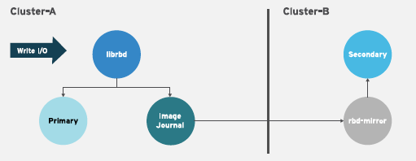
- **One-way RBD Mirroring** là cơ chế sao chép dữ liệu một chiều từ RBD image thuộc Primary Ceph cluster sang Non-primary image thuộc Secondary Ceph cluster. Client chỉ thực hiện thao tác ghi trên image Primary, trong khi image Secondary được duy trì như một bản sao dự phòng và không cho phép client ghi trực tiếp. Thành phần rbd-mirror được triển khai tại Secondary cluster, chịu trách nhiệm kết nối đến Primary cluster, thu thập các thay đổi của image và áp dụng chúng lên bản sao tại Secondary. Mô hình này hỗ trợ triển khai nhiều Secondary cluster để phục vụ các kịch bản Disaster Recovery và tăng khả năng bảo vệ dữ liệu.

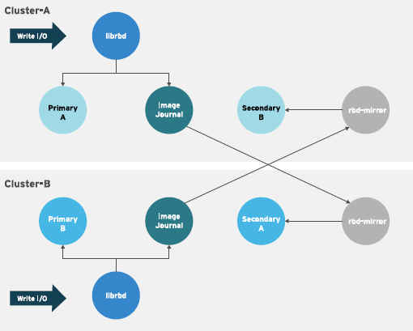
- **Two-way RBD Mirroring** là cơ chế đồng bộ dữ liệu giữa hai Ceph cluster, cho phép chuyển đổi hướng replication dựa trên vai trò Primary của RBD image. Khác với One-way Mirroring, cả hai cluster đều phải triển khai rbd-mirror daemon để hỗ trợ việc promote và demote image trên từng cluster. Khi image tại Site A là Primary, dữ liệu được đồng bộ từ A sang B. Khi xảy ra failover và image tại Site B được promote thành Primary, các thay đổi mới có thể được thực hiện tại Site B và đồng bộ ngược về Site A. Cơ chế này hỗ trợ xây dựng hệ thống Disaster Recovery với khả năng failover và failback giữa hai site, đồng thời yêu cầu kiểm soát chặt chẽ quyền ghi để tránh tình trạng split-brain
# Benchmark Results

## 1. One-way Mirroring

### Normal Write
| Chỉ số đo | Giá trị |
| :--- | :--- |
| **IOPS Trung bình** | 1,221 |
| **Throughput (Băng thông)** | 4,613 KiB/s |
| **Latency Trung bình** | 58.75 ms |
| **Latency Tail (p95)** | 144.00 ms |
| **Latency Tail (p99)** | 222.00 ms |
| **CPU FIO Client (usr / sys)** | 0.20% / 0.09% |
| **CPU Compute/Busy Node** | 59.81% |
| **CPU I/O Wait (%iowait)** | 16.51% |
| **Replication Lag** | 0s (Idle / In Sync) |

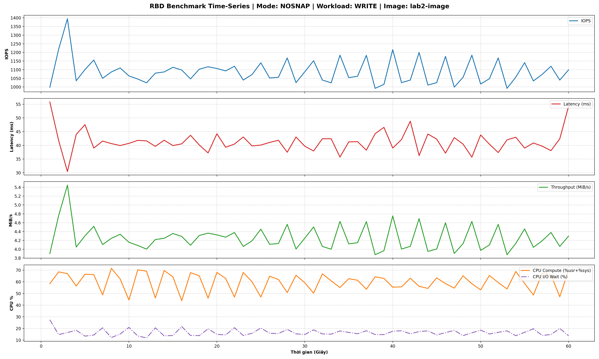
*Hình: Chuỗi thời gian (time series) các metric kịch bản Normal Write.*

---

### Normal Read
| Chỉ số đo | Giá trị |
| :--- | :--- |
| **IOPS Trung bình** | 28.9k |
| **Throughput (Băng thông)** | 113 MiB/s |
| **Latency Trung bình** | 2.12 ms |
| **Latency Tail (p95)** | 3.62 ms |
| **Latency Tail (p99)** | 5.08 ms |
| **CPU FIO Client (usr / sys)** | 2.16% / 1.40% |
| **CPU Compute/Busy Node** | 94.04% |
| **CPU I/O Wait (%iowait)** | 0.28% |
| **Replication Lag** | 0s (Idle / In Sync) |

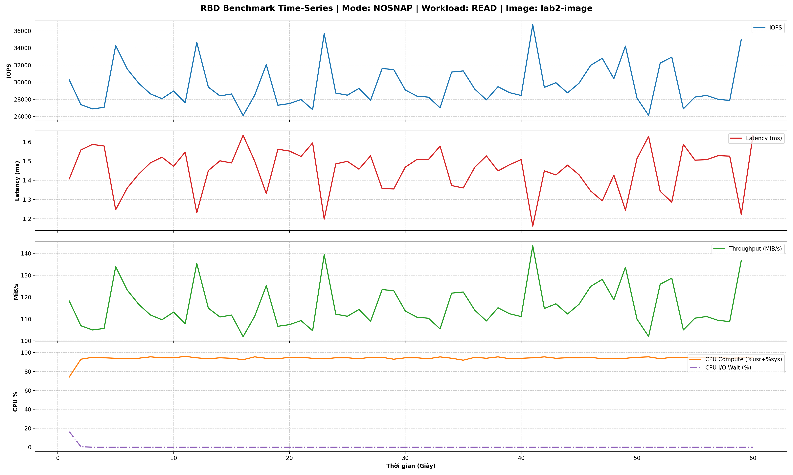
*Hình: Chuỗi thời gian (time series) các metric kịch bản Normal Read.*

---

### Journal Write
| Chỉ số đo | Giá trị |
| :--- | :--- |
| **IOPS Trung bình** | 47 |
| **Throughput (Băng thông)** | 81.1 KiB/s |
| **Latency Trung bình** | 3,668.53 ms |
| **Latency Tail (p95)** | 8,423.00 ms |
| **Latency Tail (p99)** | 13,892.00 ms |
| **CPU FIO Client (usr / sys)** | 0.01% / 0.00% |
| **CPU Compute/Busy Node** | 24.73% |
| **CPU I/O Wait (%iowait)** | 32.18% |
| **Replication Lag** | 0 entries behind (In Sync) |

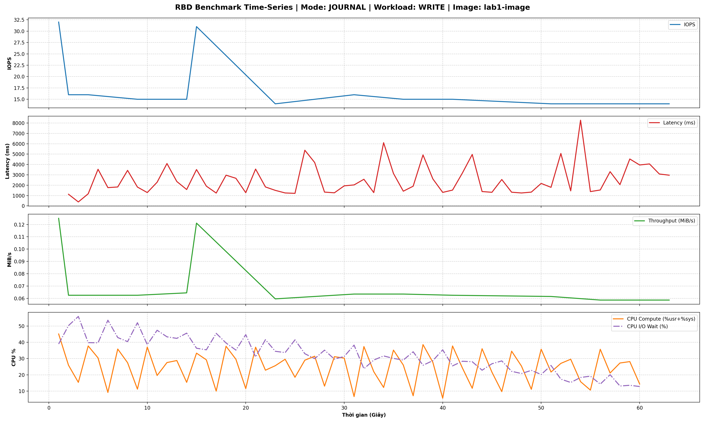
*Hình: Chuỗi thời gian (time series) các metric kịch bản Journal Write.*

---

### Journal Read
| Chỉ số đo | Giá trị |
| :--- | :--- |
| **IOPS Trung bình** | 150 |
| **Throughput (Băng thông)** | 334 KiB/s |
| **Latency Trung bình** | 1,023.39 ms |
| **Latency Tail (p95)** | 6,140.46 ms |
| **Latency Tail (p99)** | 8,220.84 ms |
| **CPU FIO Client (usr / sys)** | 0.01% / 0.01% |
| **CPU Compute/Busy Node** | 23.32% |
| **CPU I/O Wait (%iowait)** | 21.12% |
| **Replication Lag** | 0 entries behind (In Sync) |

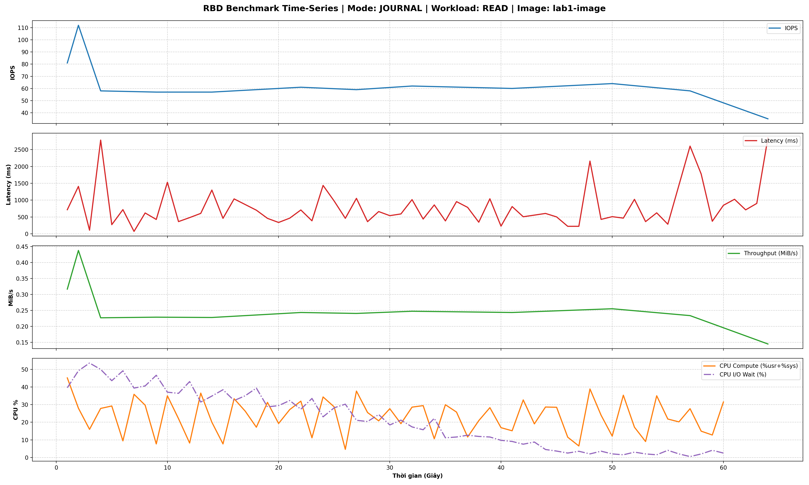
*Hình: Chuỗi thời gian (time series) các metric kịch bản Journal Read.*

---

### Snap Write
| Chỉ số đo | Giá trị |
| :--- | :--- |
| **IOPS Trung bình** | 1,138 |
| **Throughput (Băng thông)** | 4,375 KiB/s |
| **Latency Trung bình** | 75.00 ms |
| **Latency Tail (p95)** | 163.00 ms |
| **Latency Tail (p99)** | 617.00 ms |
| **CPU FIO Client (usr / sys)** | 0.17% / 0.06% |
| **CPU Compute/Busy Node** | 54.57% |
| **CPU I/O Wait (%iowait)** | 14.43% |
| **Replication Lag** | 0s (Idle / In Sync) |

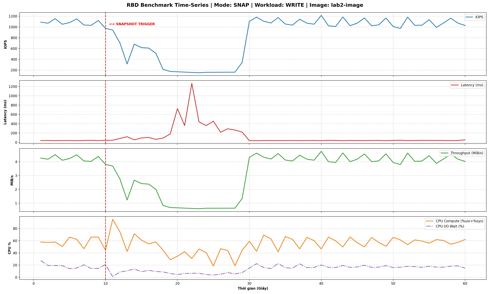
*Hình: Chuỗi thời gian (time series) các metric kịch bản Snap Write.*

---

### Snap Read
| Chỉ số đo | Giá trị |
| :--- | :--- |
| **IOPS Trung bình** | 23.7k |
| **Throughput (Băng thông)** | 92.6 MiB/s |
| **Latency Trung bình** | 2.28 ms |
| **Latency Tail (p95)** | 3.95 ms |
| **Latency Tail (p99)** | 6.39 ms |
| **CPU FIO Client (usr / sys)** | 2.11% / 1.34% |
| **CPU Compute/Busy Node** | 93.74% |
| **CPU I/O Wait (%iowait)** | 0.32% |
| **Replication Lag** | 0s (Idle / In Sync) |

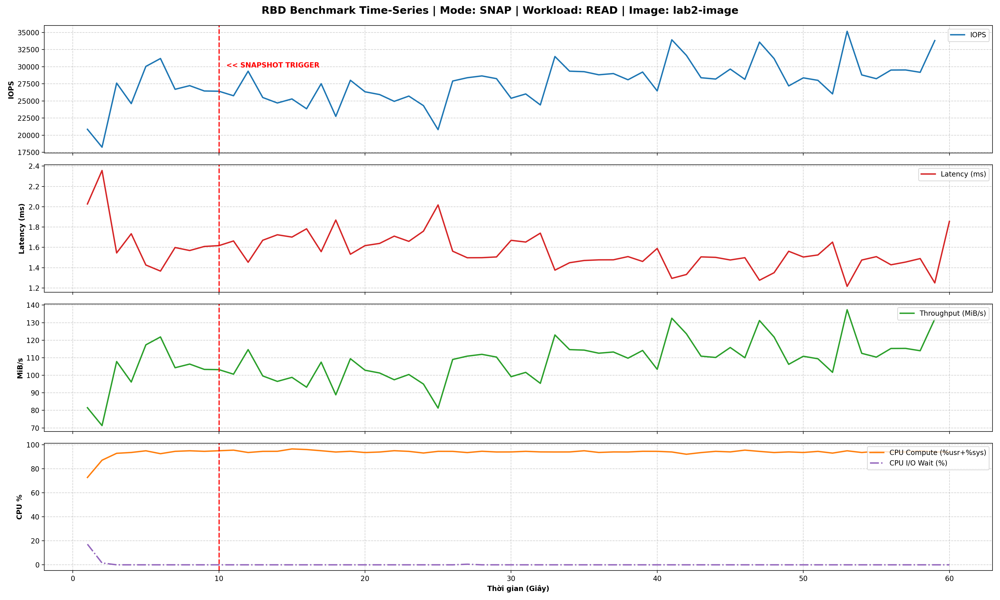
*Hình: Chuỗi thời gian (time series) các metric kịch bản Snap Read.*

---

## 2. Two-way Mirroring

### Normal Write
| Chỉ số đo | Site A | Site B |
| :--- | :--- | :--- |
| **IOPS Trung bình** | 1,456 | 1,555 |
| **Throughput (Băng thông)** | 5,727 KiB/s | 6,084 KiB/s |
| **Latency Trung bình** | 58.08 ms | 54.84 ms |
| **Latency Tail (p95)** | 140.00 ms | 140.00 ms |
| **Latency Tail (p99)** | 213.00 ms | 215.00 ms |
| **CPU FIO Client (usr / sys)** | 0.21% / 0.08% | 0.20% / 0.08% |
| **CPU Compute/Busy Node** | 70.58% | 57.67% |
| **CPU I/O Wait (%iowait)** | 12.08% | 16.84% |
| **Replication Lag** | 0s (Idle / In Sync) | 0s (Idle / In Sync) |

| Biểu đồ Site A | Biểu đồ Site B |
| :---: | :---: |
| 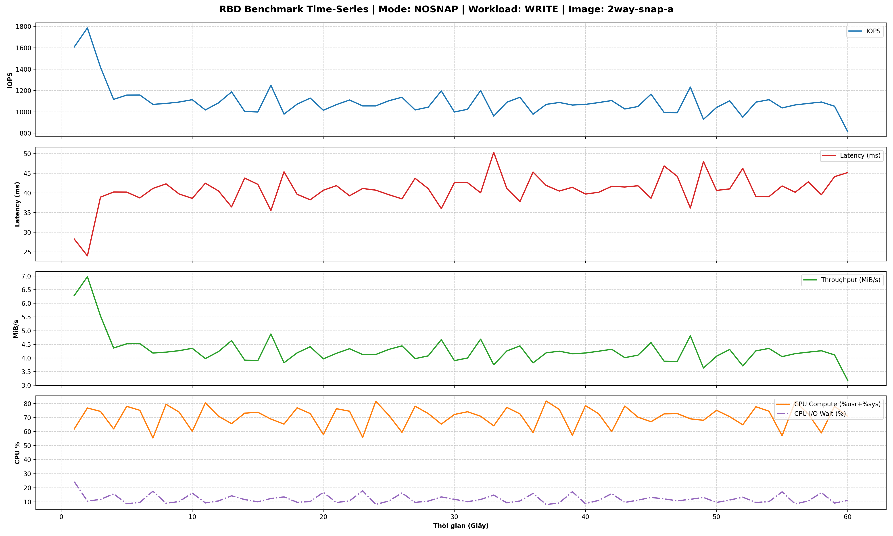 | 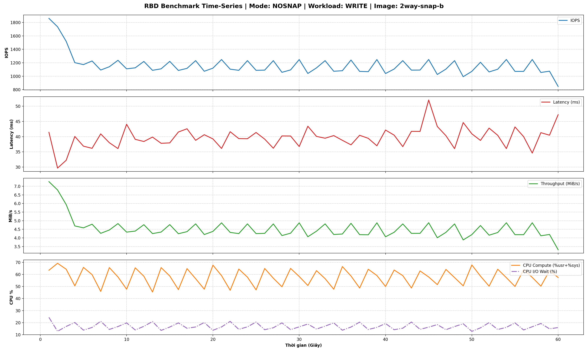 |
| *Time series metrics: Site A* | *Time series metrics: Site B* |

---

### Normal Read
| Chỉ số đo | Site A | Site B |
| :--- | :--- | :--- |
| **IOPS Trung bình** | 6,013 | 5,890 |
| **Throughput (Băng thông)** | 23.4 MiB/s | 22.9 MiB/s |
| **Latency Trung bình** | 2.46 ms | 2.40 ms |
| **Latency Tail (p95)** | 3.82 ms | 3.75 ms |
| **Latency Tail (p99)** | 9.37 ms | 12.26 ms |
| **CPU FIO Client (usr / sys)** | 1.94% / 1.21% | 1.98% / 1.19% |
| **CPU Compute/Busy Node** | 86.04% | 84.66% |
| **CPU I/O Wait (%iowait)** | 0.74% | 0.68% |
| **Replication Lag** | 0s (Idle / In Sync) | 0s (Idle / In Sync) |

| Biểu đồ Site A | Biểu đồ Site B |
| :---: | :---: |
| 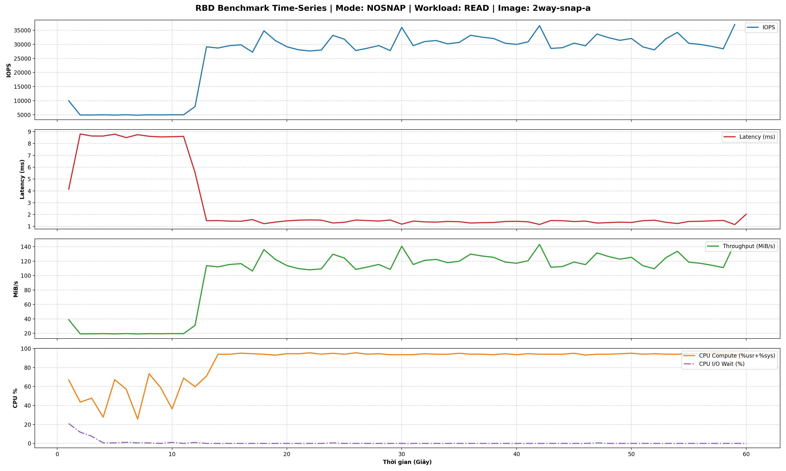 | 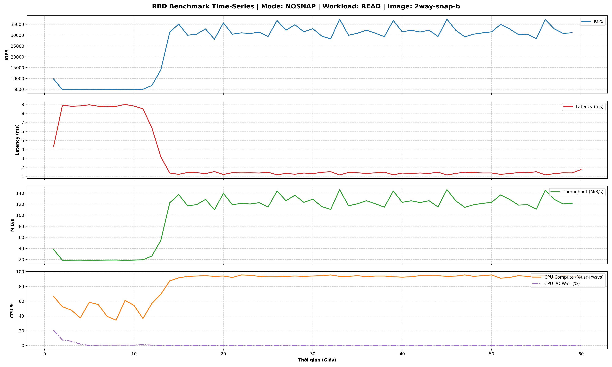 |
| *Time series metrics: Site A* | *Time series metrics: Site B* |

---

### Journal Write
| Chỉ số đo | Site A | Site B |
| :--- | :--- | :--- |
| **IOPS Trung bình** | 40 | 149 |
| **Throughput (Băng thông)** | 67.6 KiB/s | 449 KiB/s |
| **Latency Trung bình** | 4,358.31 ms | 1,277.61 ms |
| **Latency Tail (p95)** | 8,658.00 ms | 3,540.00 ms |
| **Latency Tail (p99)** | 17,113.00 ms | 5,671.00 ms |
| **CPU FIO Client (usr / sys)** | 0.00% / 0.01% | 0.00% / 0.00% |
| **CPU Compute/Busy Node** | 26.10% | 33.54% |
| **CPU I/O Wait (%iowait)** | 44.62% | 42.03% |
| **Replication Lag** | 0 entries behind (In Sync) | 0 entries behind (In Sync) |

| Biểu đồ Site A | Biểu đồ Site B |
| :---: | :---: |
| 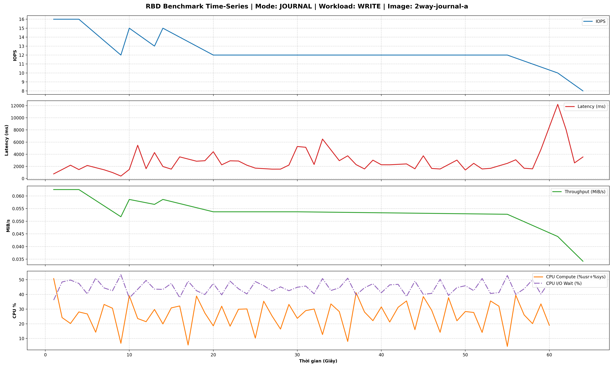 | 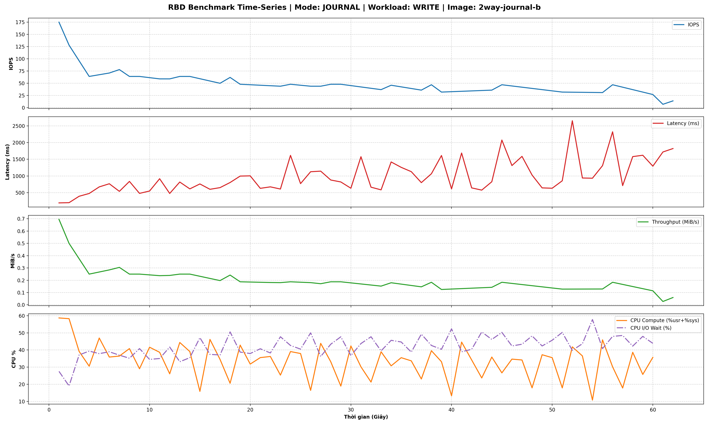 |
| *Time series metrics: Site A* | *Time series metrics: Site B* |

---

### Journal Read
| Chỉ số đo | Site A | Site B |
| :--- | :--- | :--- |
| **IOPS Trung bình** | 107 | 212 |
| **Throughput (Băng thông)** | 216 KiB/s | 617 KiB/s |
| **Latency Trung bình** | 1,040.97 ms | 469.03 ms |
| **Latency Tail (p95)** | 5,939.14 ms | 2,634.02 ms |
| **Latency Tail (p99)** | 9,596.57 ms | 3,707.76 ms |
| **CPU FIO Client (usr / sys)** | 0.01% / 0.01% | 0.01% / 0.01% |
| **CPU Compute/Busy Node** | 28.64% | 32.22% |
| **CPU I/O Wait (%iowait)** | 39.86% | 6.22% |
| **Replication Lag** | 0 entries behind (In Sync) | 0 entries behind (In Sync) |

| Biểu đồ Site A | Biểu đồ Site B |
| :---: | :---: |
| 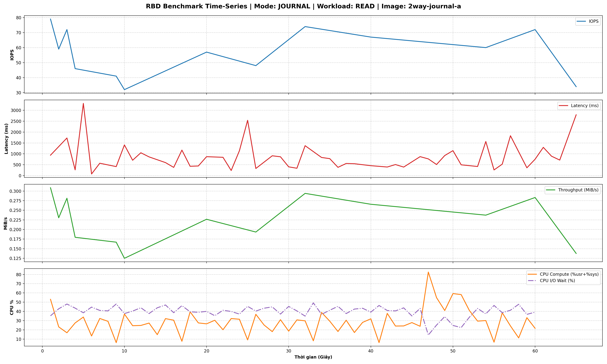 | 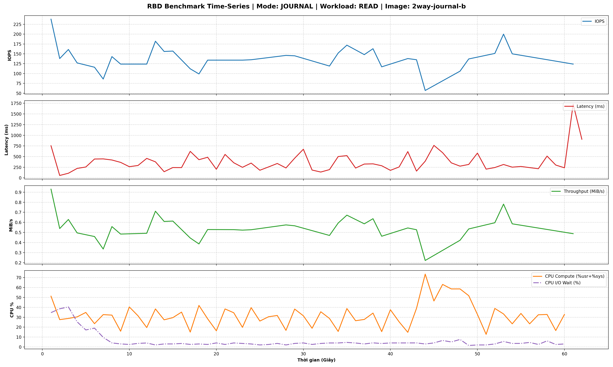 |
| *Time series metrics: Site A* | *Time series metrics: Site B* |

---

### Snapshot Write
| Chỉ số đo | Site A | Site B |
| :--- | :--- | :--- |
| **IOPS Trung bình** | 1,102 | 1,144 |
| **Throughput (Băng thông)** | 4,289 KiB/s | 4,490 KiB/s |
| **Latency Trung bình** | 71.26 ms | 72.41 ms |
| **Latency Tail (p95)** | 161.00 ms | 155.00 ms |
| **Latency Tail (p99)** | 275.00 ms | 380.00 ms |
| **CPU FIO Client (usr / sys)** | 0.18% / 0.06% | 0.15% / 0.07% |
| **CPU Compute/Busy Node** | 68.01% | 53.60% |
| **CPU I/O Wait (%iowait)** | 10.61% | 13.83% |
| **Replication Lag** | 0s (Idle / In Sync) | Syncing (Lag: 0s, Duration: 0.0s) |

| Biểu đồ Site A | Biểu đồ Site B |
| :---: | :---: |
| 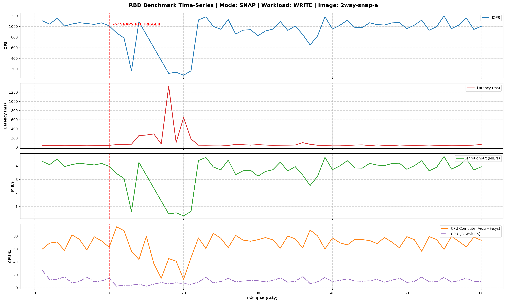 | 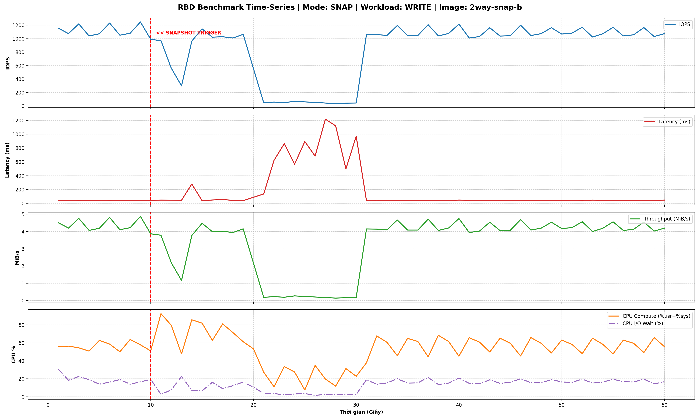 |
| *Time series metrics: Site A* | *Time series metrics: Site B* |

---

### Snapshot Read
| Chỉ số đo | Site A | Site B |
| :--- | :--- | :--- |
| **IOPS Trung bình** | 5,993 | 5,882 |
| **Throughput (Băng thông)** | 23.4 MiB/s | 22.9 MiB/s |
| **Latency Trung bình** | 2.56 ms | 2.55 ms |
| **Latency Tail (p95)** | 4.29 ms | 4.29 ms |
| **Latency Tail (p99)** | 10.42 ms | 11.21 ms |
| **CPU FIO Client (usr / sys)** | 1.88% / 1.22% | 1.89% / 1.18% |
| **CPU Compute/Busy Node** | 88.50% | 87.29% |
| **CPU I/O Wait (%iowait)** | 0.66% | 0.65% |
| **Replication Lag** | 0s (Idle / In Sync) | 0s (Idle / In Sync) |

| Biểu đồ Site A | Biểu đồ Site B |
| :---: | :---: |
| 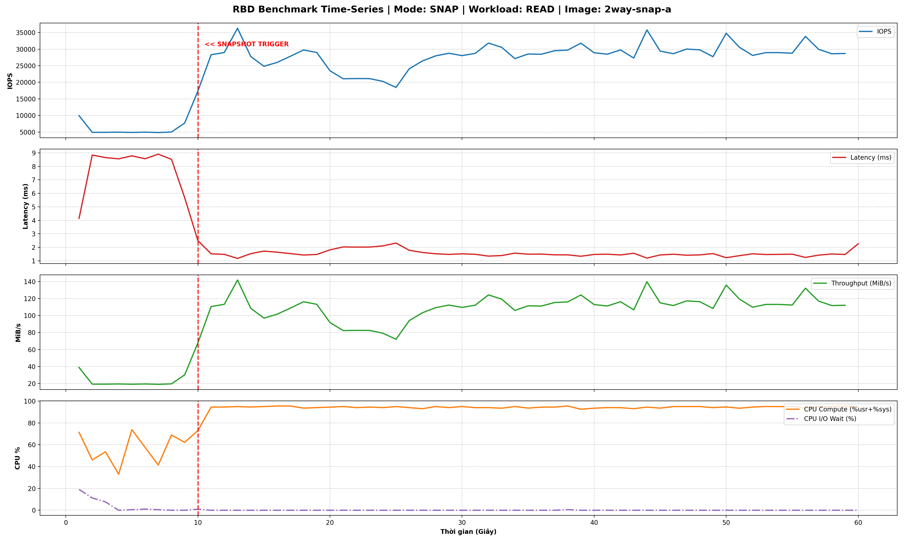 | 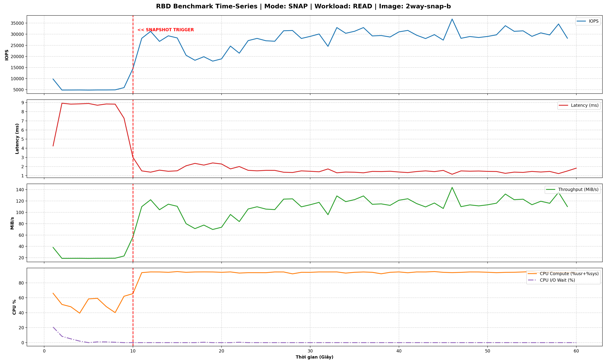 |
| *Time series metrics: Site A* | *Time series metrics: Site B* |